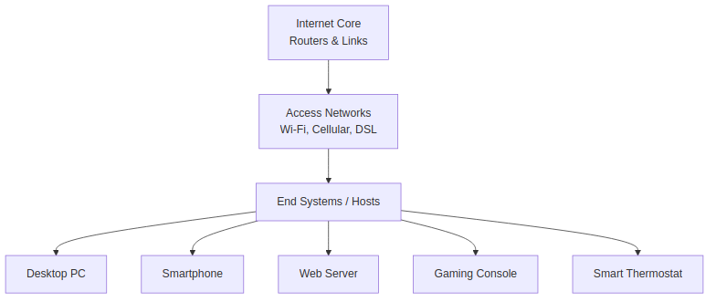
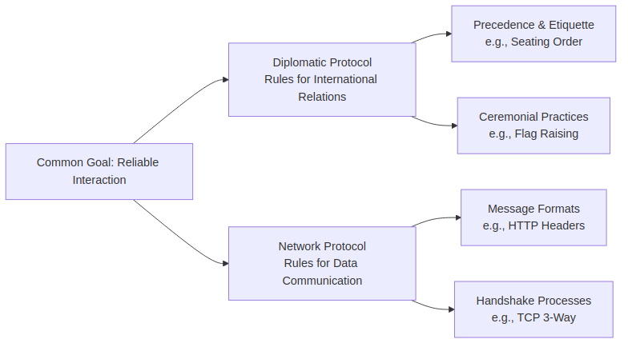

# Chapter 1 Review Questions Answers

Based on the context from Chapter 1 of "Computer Networking: A Top-Down Approach" by Kurose and Ross, here are the answers to the review questions R1, R2, and R3. Each answer is explained clearly, with relevant examples and visualizations where appropriate.

## R1. What is the difference between a host and an end system? List several different types of end systems. Is a Web server an end system?

### Explanation

In the context of computer networking, the terms **host** and **end system** are often used interchangeably. Both refer to devices that are connected to the network and run applications at the "edge" of the network (i.e., the endpoints where users interact with the internet). There is no significant difference between them in modern networking terminology—they both describe the same concept: computing devices that send, receive, or forward data.

However, historically, "host" might imply a device that hosts services or applications, while "end system" emphasizes its role as a terminal point in the network. In practice, they are synonyms, especially in the OSI and TCP/IP models discussed in the chapter.

### Types of End Systems

End systems include a wide variety of devices that connect to the internet. Here are several examples:

- **Traditional computers**: Desktop PCs and laptops (e.g., running Windows, macOS, or Linux).
- **Mobile devices**: Smartphones and tablets (e.g., iPhones, Android devices) that access the internet via cellular or Wi-Fi.
- **Servers**: Powerful computers that provide services, such as web hosting or data storage.
- **Non-traditional devices**: TVs, gaming consoles (e.g., PlayStation), thermostats, home security systems, wearable devices like smartwatches, cars, and even appliances like refrigerators with internet connectivity (part of the "Internet of Things" or IoT).

### Is a Web Server an End System?

Yes, a Web server is an end system. It is a type of server that hosts websites and responds to HTTP requests from clients (e.g., browsers). It operates at the edge of the network, just like a user's laptop or smartphone, and is connected via ISPs (Internet Service Providers).

### Visualization: End Systems in the Internet Structure

The diagram below illustrates how end systems fit into the overall internet architecture, showing various types connected through access networks.

This flowchart shows the internet's layered structure, with end systems at the edge, connected via access networks to the core.

## R2. The word protocol is often used to describe diplomatic relations. How does Wikipedia describe diplomatic protocol?

### Explanation

The question draws an analogy between network protocols (sets of rules for communication in computer networks) and diplomatic protocols (rules of etiquette in international relations). While the chapter focuses on network protocols, this question asks for Wikipedia's description of diplomatic protocol to highlight the concept of structured rules in different contexts.

From Wikipedia (based on general knowledge of its content), diplomatic protocol refers to the established rules, procedures, and etiquette governing interactions between diplomats, governments, and international representatives. It includes formal behaviors such as precedence (order of importance), ceremonial practices, communication norms, and cultural sensitivities during diplomatic engagements. For example:

- **Precedence**: Rules determining the order in which diplomats are seated or addressed (e.g., based on seniority or host country's customs).
- **Ceremonial practices**: Rituals like flag-raising, toasts, or gift exchanges.
- **Communication norms**: Formal language, titles, and channels for negotiations.

This is analogous to network protocols, which define rules for data exchange (e.g., TCP/IP for reliable communication). Both ensure smooth, predictable interactions: diplomatic protocol prevents misunderstandings in politics, while network protocols prevent errors in data transmission.

In networking, as explained in the chapter, a protocol defines message formats, order of exchange, and actions on events (e.g., TCP's three-way handshake for connection setup).

### Visualization: Analogy Between Diplomatic and Network Protocols

The diagram compares the two concepts, showing how structured rules enable reliable interactions.

This mind map illustrates the parallel between diplomatic and network protocols, emphasizing structured rules for reliability.

## R3. Why are standards important for protocols?

### Explanation

Standards are crucial for protocols because they ensure **interoperability**—the ability of different devices, systems, and manufacturers to work together seamlessly. Without standards, products from different companies might use incompatible rules, leading to communication failures.

In the chapter, protocols like TCP/IP, HTTP, and IP are developed by standards bodies (e.g., IETF for internet standards). Standards:

- Define exact rules for message formats, timing, and error handling.
- Allow global compatibility (e.g., your browser can access any website worldwide).
- Promote innovation while maintaining reliability (e.g., new devices can integrate without breaking existing networks).
- Prevent vendor lock-in (dependence on one company's products).

For example, without HTTP standards, a Chrome browser couldn't reliably communicate with an Apache web server. Standards also evolve (e.g., HTTP/1.1 to HTTP/2 for better performance).

### Visualization: Importance of Standards in Protocols

The diagram shows how standards enable interoperability across diverse systems.

This flowchart contrasts scenarios with and without standards, highlighting why they are essential for networking.
