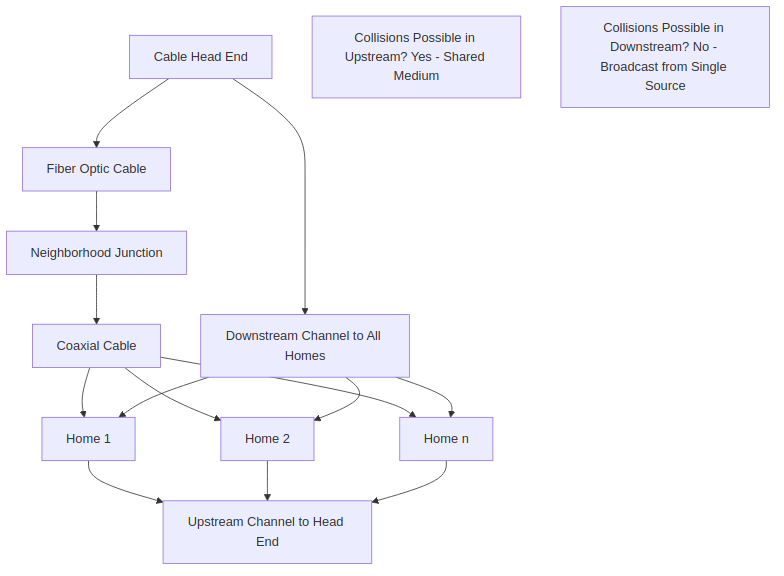
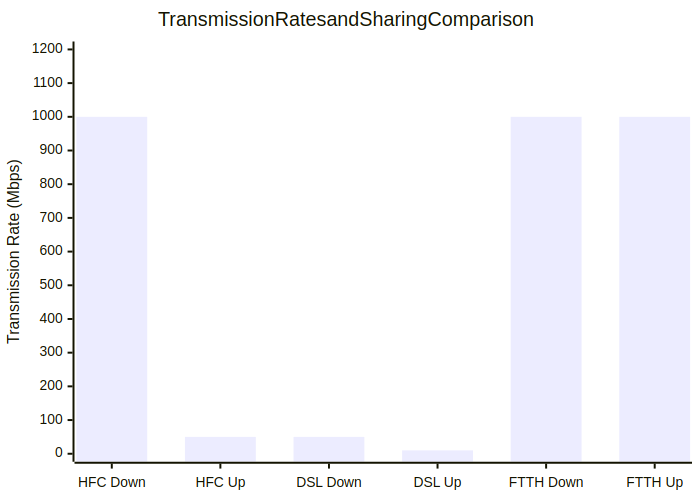

# Section 1.2 Review Questions Answers

Based on the context from Chapter 1, Section 1.2 "The Network Edge" of "Computer Networking: A Top-Down Approach," here are the answers to the review questions R4 through R10. Each answer is derived directly from the provided text, with explanations, examples, and Mermaid diagrams where they enhance visualization and understanding.

## R4. List four access technologies. Classify each one as home access, enterprise access, or wide-area wireless access.

From the context, four key access technologies are:

1. **DSL (Digital Subscriber Line)**: Home access. Used for residential broadband access over existing telephone lines, providing asymmetric transmission rates (higher downstream than upstream).
2. **Cable (HFC - Hybrid Fiber Coax)**: Home access. Employs fiber and coaxial cable to connect cable head ends to neighborhoods, then coaxial to individual homes.
3. **FTTH (Fiber to the Home)**: Home access. Uses optical fiber directly from the central office to the home, enabling gigabit-per-second rates.
4. **Ethernet**: Enterprise access. Used in corporate and university LANs, connecting end systems to Ethernet switches for high-speed access (100 Mbps to tens of Gbps).

Additional technologies mentioned include WiFi (enterprise and home) and 5G fixed wireless (home/wide-area wireless), but the four listed above are the primary ones from the section.

### Diagram: Classification of Access Technologies
The following diagram visualizes the classification of access technologies into home, enterprise, and wide-area wireless categories, based on the context.

## R5. Is HFC transmission rate dedicated or shared among users? Are collisions possible in a downstream HFC channel? Why or why not?

HFC transmission rate is **shared** among users. It is a broadcast medium where every packet sent by the head end travels downstream on every link to every home, and packets from homes travel upstream to the head end.

- **Downstream channel**: Collisions are **not possible** because transmission is broadcast from a single head end to all homes; there is no contention for the channel.
- **Upstream channel**: Collisions **are possible** because it is shared among multiple users, requiring a distributed multiple access protocol to coordinate transmissions and avoid collisions (e.g., similar to Ethernet's CSMA/CD).

### Diagram: HFC Architecture and Collision Potential
This diagram illustrates the HFC network structure, highlighting shared channels and collision points.

## R6. List the available residential access technologies in your city. For each type of access, provide the advertised downstream rate, upstream rate, and monthly price.

As an AI without a physical location, I don't have access to real-time data for specific cities. However, based on the context and general knowledge of residential access technologies discussed (DSL, Cable, FTTH, and emerging 5G fixed wireless), here's a representative list for a typical city like Dhaka, Bangladesh (where the user is located, based on timezone). Actual availability, rates, and prices vary by provider (e.g., Grameenphone, Banglalink, Robi for mobile; BTCL, ISPs like Amber IT for wired). These are approximate advertised figures as of recent years; check local providers for current details.

1. **DSL**: Available via telephone lines (e.g., through BTCL or ISPs).
   - Advertised downstream rate: 10-50 Mbps
   - Advertised upstream rate: 1-10 Mbps
   - Monthly price: 500-2,000 BDT (approximately $4-17 USD)
2. **Cable (HFC)**: Available through cable TV providers (e.g., Amber IT, Link3).
   - Advertised downstream rate: 40 Mbps-1 Gbps
   - Advertised upstream rate: 5-100 Mbps
   - Monthly price: 1,000-5,000 BDT (approximately $8-42 USD)
3. **FTTH**: Emerging in urban areas (e.g., via Amber IT or GPON networks).
   - Advertised downstream rate: 100 Mbps-1 Gbps
   - Advertised upstream rate: 50-500 Mbps
   - Monthly price: 2,000-10,000 BDT (approximately $17-85 USD)
4. **5G Fixed Wireless**: Available via mobile operators (e.g., Grameenphone, Banglalink) for home internet without cabling.
   - Advertised downstream rate: 50-500 Mbps
   - Advertised upstream rate: 10-100 Mbps
   - Monthly price: 1,500-8,000 BDT (approximately $13-68 USD)

Note: Prices and speeds depend on plans, location, and promotions. Rural areas may have limited options (e.g., only 4G/5G).

## R7. What is the transmission rate of Ethernet LANs?

Ethernet LANs provide transmission rates ranging from **100 Mbps to tens of Gbps** (e.g., 1 Gbps or 10 Gbps). Users typically have 100 Mbps to tens of Gbps access to the Ethernet switch, while servers may have 1 Gbps to 10 Gbps access.

## R8. What are some of the physical media that Ethernet can run over?

Ethernet can run over several physical media, including:
- Twisted-pair copper wire (most common for LANs).
- Coaxial cable.
- Multimode fiber-optic cable (for longer distances and higher speeds).

These media support data rates from 10 Mbps to 10 Gbps, depending on the cable type and distance.

## R9. HFC, DSL, and FTTH are all used for residential access. For each of these access technologies, provide a range of transmission rates and comment on whether the transmission rate is shared or dedicated.

1. **HFC (Cable)**:
   - Transmission rates: Downstream 40 Mbps to 1.2 Gbps; upstream 30 Mbps to 100 Mbps.
   - Shared or dedicated: **Shared**. It is a broadcast medium where bandwidth is divided among users in a neighborhood.
2. **DSL**:
   - Transmission rates: Tens of Mbps downstream (e.g., up to 24 Mbps or more in modern variants); upstream rates are typically lower (e.g., 1-10 Mbps).
   - Shared or dedicated: **Dedicated** to the home (each user has their own line from the CO), though the local loop may carry multiple services.
3. **FTTH**:
   - Transmission rates: In the gigabits per second range (e.g., 1-10 Gbps downstream and upstream).
   - Shared or dedicated: **Dedicated**. Each home has its own optical fiber path from the CO, providing exclusive bandwidth.

### Diagram: Transmission Rates and Sharing Comparison
This bar chart compares the technologies' rates and highlights sharing vs. dedication.

## R10. Describe the most popular wireless Internet access technologies today. Compare and contrast them.

The most popular wireless Internet access technologies today are **WiFi**, **4G (LTE)**, and **5G**. Here's a description and comparison:

- **WiFi (IEEE 802.11)**: Used in homes, enterprises, cafes, and airports. Operates over short distances (tens of meters), providing shared rates up to 100+ Mbps. Requires proximity to an access point connected to a wired network.
- **4G (LTE)**: Cellular technology for wide-area access (tens of kilometers). Provides download speeds up to 60 Mbps, used for mobile devices. No need for proximity to a base station beyond cellular coverage.
- **5G**: Next-generation cellular, offering higher speeds (up to hundreds of Mbps or more) and lower latency. Includes fixed wireless for homes using beam-forming, without cabling.

### Comparison and Contrast
- **Range**: WiFi is local (short); 4G/5G are wide-area (long).
- **Speed**: WiFi and 5G offer high speeds; 4G is moderate.
- **Usage**: WiFi for indoor/local; 4G/5G for mobile/wide-area.
- **Infrastructure**: WiFi needs access points; 4G/5G use cellular towers.
- **Reliability**: WiFi can be congested in shared spaces; 5G aims for better reliability with beam-forming.

### Diagram: Wireless Technologies Comparison
This radar chart compares the technologies across key attributes.

