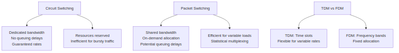
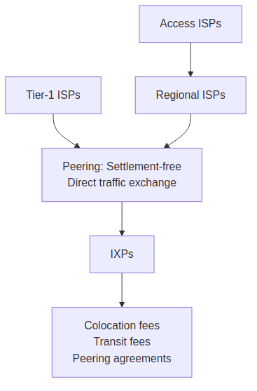
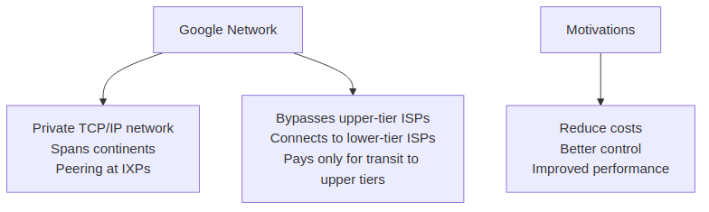

# Section 1.3 Review Questions Answers

Based on the context from Section 1.3 "The Network Core" of "Computer Networking: A Top-Down Approach" by Kurose and Ross, here are the detailed answers to the review questions R11 through R15. Each answer includes comprehensive explanations, step-by-step reasoning, examples from the textbook, and Mermaid diagrams for visualization. These are designed for exam preparation, highlighting key concepts, formulas, and comparisons.

## R11. Suppose there is exactly one packet switch between a sending host and a receiving host. The transmission rates between the sending host and the switch and between the switch and the receiving host are R1 and R2, respectively. Assuming that the switch uses store-and-forward packet switching, what is the total end-to-end delay to send a packet of length L? (Ignore queuing, propagation delay, and processing delay.)

### Detailed Explanation
In packet switching, data is broken into packets that travel through the network via switches (routers or link-layer switches). Store-and-forward transmission is a key mechanism where a switch must receive the entire packet before it can begin forwarding it to the next hop. This ensures the packet is complete and can be processed (e.g., for error checking or routing decisions).

- **Step 1: Transmission from sender to switch**: The sender transmits the packet of length L bits at rate R1 bits/sec. Time taken = L / R1 seconds.
- **Step 2: Processing at switch**: The switch receives the entire packet (store phase) and then forwards it (forward phase) to the receiver at rate R2 bits/sec. Time taken for forwarding = L / R2 seconds.
- **Total delay**: The end-to-end delay is the sum of the two transmission times, as the forwarding starts immediately after receiving the packet (no queuing or propagation delays considered here).

**Formula**: Total delay = L/R1 + L/R2

This formula generalizes to N links: Delay = N * (L/R) for identical rates R, but here rates differ.

**Example**: Suppose L = 1,000 bits, R1 = 1 Mbps (1,000,000 bps), R2 = 500,000 bps. Delay = (1,000 / 1,000,000) + (1,000 / 500,000) = 0.001 + 0.002 = 0.003 seconds (3 ms). This shows how different link rates affect delay.

**Key Insight for Exams**: Store-and-forward ensures reliability but introduces delay proportional to packet size and link rates. Contrast with cut-through switching (not discussed here), where forwarding starts after the header.

### Diagram: Store-and-Forward Delay

This sequence diagram illustrates the timeline: transmission to switch, store-and-forward at switch, and final transmission to receiver.

## R12. What advantage does a circuit-switched network have over a packet-switched network? What advantages does TDM have over FDM in a circuit-switched network?

### Detailed Explanation
Circuit switching and packet switching are two fundamental approaches to moving data through networks (links and switches). Circuit switching reserves resources end-to-end before transmission, while packet switching allocates resources on-demand.

- **Circuit-switched advantage over packet-switched**:
  - **Dedicated bandwidth**: Resources (link transmission rate, buffers) are reserved for the entire session, guaranteeing constant transmission rates without queuing delays.
  - **No congestion impact**: Since bandwidth is pre-allocated, the connection is immune to network congestion (overloaded links). This is ideal for real-time applications like voice calls, where variable delays are unacceptable.
  - **Drawback**: Inefficient for bursty traffic (e.g., web browsing), as idle resources can't be used by others.
  - **Packet-switched counterpoint**: Shares bandwidth dynamically, better for variable loads but prone to delays due to queuing.

- **TDM (Time-Division Multiplexing) advantages over FDM (Frequency-Division Multiplexing) in circuit-switched networks**:
  - **Flexibility**: TDM divides time into slots (e.g., frames with fixed slots), allowing dynamic allocation. It's better for multiplexing different data types (voice, data) with variable rates.
  - **Digital implementation**: Easier to implement digitally, supporting higher data rates and error correction. FDM divides frequency bands, which is fixed and less adaptable to bursty traffic.
  - **Efficiency**: TDM can handle statistical multiplexing better, while FDM wastes bandwidth on idle channels.

**Example**: Traditional telephone networks use circuit switching with TDM for voice calls—each call gets dedicated time slots, ensuring clear, uninterrupted audio. Packet switching (like the Internet) is better for email, where delays are tolerable.

**Key Insight for Exams**: Circuit switching = "Reservation-based" (guaranteed but wasteful); Packet switching = "On-demand" (efficient but variable). TDM > FDM for adaptability in modern networks.

### Diagram: Circuit vs Packet Switching

This mind map compares the two switching types and multiplexing methods, emphasizing advantages and trade-offs.

## R13. Suppose users share a 2 Mbps link. Also suppose each user transmits continuously at 1 Mbps when transmitting, but each user transmits only 20 percent of the time. (See the discussion of statistical multiplexing in Section 1.3.)

### Detailed Explanation
This problem illustrates statistical multiplexing, where packet switching efficiently shares a link among users who are not always active. Users burst (transmit intermittently), allowing the link to support more users than circuit switching.

### a. When circuit switching is used, how many users can be supported?
- Circuit switching requires dedicated bandwidth per user: 1 Mbps each.
- Link capacity: 2 Mbps.
- Maximum users: 2 Mbps / 1 Mbps = 2 users.
- **Reasoning**: No sharing; each user gets exclusive bandwidth, even when idle.

### b. For the remainder of this problem, suppose packet switching is used. Why will there be essentially no queuing delay before the link if two or fewer users transmit at the same time? Why will there be a queuing delay if three users transmit at the same time?
- **Two or fewer users transmitting**: Aggregate rate ≤ 2 Mbps (link capacity). Packets flow without queuing, as the output rate matches or exceeds input.
- **Three users transmitting**: Aggregate rate = 3 Mbps > 2 Mbps. Excess packets queue in buffers, causing delays. Queuing persists until the rate drops below 2 Mbps.
- **Key Concept**: Packet switching uses statistical multiplexing—idle time from one user can be used by others, but simultaneous activity causes congestion.

### c. Find the probability that a given user is transmitting.
- Each user transmits 20% of the time.
- Probability = 0.2 (or 1/5).

### d. Suppose now there are three users. Find the probability that at any given time, all three users are transmitting simultaneously. Find the fraction of time during which the queue grows.
- **Probability all three transmit**: Assuming independence, P = (0.2)^3 = 0.008 (0.8%).
- **Fraction of time queue grows**: This equals the probability that all three are transmitting simultaneously, as that's when the aggregate rate exceeds 2 Mbps. Thus, 0.008 or 0.8%.
- **Calculation Insight**: For N users, P(all active) = (0.2)^N. Here, N=3, and since 3*1 Mbps = 3 Mbps > 2 Mbps, queuing occurs only when all are active.

**Example**: With 35 users (as in the textbook), P(≥11 active) ≈ 0.0004, showing packet switching scales well.

**Key Insight for Exams**: Circuit switching supports fewer users due to dedicated allocation; packet switching leverages statistical multiplexing for efficiency but risks queuing during peaks.

### Diagram: Statistical Multiplexing

This flowchart shows circuit vs. packet limits and queuing conditions.

## R14. Why will two ISPs at the same level of the hierarchy often peer with each other? How does an IXP earn money?

### Detailed Explanation
The Internet is a "network of networks" with a hierarchical structure: Tier-1 ISPs (top, global), regional ISPs, and access ISPs (bottom, local). Peering and IXPs optimize connectivity and costs.

- **Why ISPs at the same level peer**:
  - **Cost reduction**: Peering allows direct traffic exchange without paying upstream providers (customer-provider model). Tier-1 ISPs peer settlement-free; lower-tier ISPs peer to avoid transit fees.
  - **Efficiency**: Direct connections reduce latency and routing hops. For example, two regional ISPs in the same region peer to handle local traffic locally.
  - **Mutual benefit**: Both ISPs gain better performance and lower costs. Peering is common among Tier-1 ISPs (e.g., Level 3 and AT&T) and regional ISPs.
  - **Contrast with customer-provider**: In hierarchy, lower-tier ISPs pay higher-tier ones; peering is lateral (same level).

- **How IXPs earn money**:
  - **Colocation fees**: ISPs pay to house routers/switches in the IXP's facility.
  - **Transit fees**: Fees for connecting to other networks via the IXP.
  - **Peering agreements**: Revenue from facilitating peering (though often settlement-free, IXPs charge for infrastructure).
  - **Example**: IXPs like AMS-IX or DE-CIX host hundreds of ISPs, earning millions annually.

**Example**: Google's network peers at IXPs to bypass costly upper-tier transit.

**Key Insight for Exams**: Peering reduces costs and improves routing; IXPs are neutral hubs that monetize infrastructure and connectivity.

### Diagram: ISP Hierarchy and Peering

This graph shows the hierarchy, peering links, and IXP revenue streams.

## R15. Some content providers have created their own networks. Describe Google's network. What motivates content providers to create these networks?

### Detailed Explanation
Content providers (e.g., Netflix, Google) build private networks to optimize delivery, bypassing the public Internet's limitations.

- **Google's network description**:
  - **Private TCP/IP network**: Spans continents (North America, Europe, Asia, etc.), separate from the public Internet, carrying only Google traffic (e.g., YouTube, Search).
  - **Structure**: 19+ major data centers with tens/hundreds of thousands of servers; smaller centers at IXPs. Interconnected via Google's private fiber network.
  - **Connectivity**: Peers (settlement-free) with lower-tier ISPs at IXPs; connects to Tier-1 ISPs for unreachable access ISPs, paying for transit.
  - **Bypassing**: Avoids upper-tier ISPs by direct connections, reducing hops and latency.

- **Motivations for content providers**:
  - **Cost reduction**: Avoid paying upper-tier ISPs for massive traffic (e.g., video streams).
  - **Control**: Better management of delivery, caching, and performance (e.g., adaptive streaming).
  - **Performance**: Lower latency, higher reliability, and scalability for billions of users.
  - **Example**: Netflix uses CDNs (similar to Google's) to cache content near users, improving streaming quality.

**Key Insight for Exams**: Private networks like Google's represent "Network Structure 5" (content-provider networks), evolving from hierarchical ISP structures for efficiency.

### Diagram: Content Provider Networks

This diagram illustrates Google's network architecture and motivations.