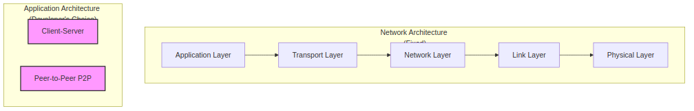

# Section 2.1 Review Questions: Principles of Network Applications

This document provides detailed answers to the review questions for Section 2.1, based on the context from "Computer Networking: A Top-Down Approach."

---

### **R1. List five nonproprietary Internet applications and the application-layer protocols that they use.**

Based on Figure 2.5 in the provided text, here are five nonproprietary (open standard) Internet applications and their corresponding application-layer protocols:

1.  **The Web:** Uses the **HyperText Transfer Protocol (HTTP)** for requesting and transferring web documents.
2.  **E-mail:** Uses the **Simple Mail Transfer Protocol (SMTP)** for sending emails between servers. It also uses other protocols like POP3 or IMAP for retrieving emails.
3.  **File Transfer:** Uses the **File Transfer Protocol (FTP)** for transferring files between a client and a server.
4.  **Remote Terminal Access:** Uses **Telnet** to provide bidirectional interactive text-oriented communication.
5.  **Internet Telephony:** Often uses the **Session Initiation Protocol (SIP)** for managing real-time sessions, which can include voice or video.

---

### **R2. What is the difference between network architecture and application architecture?**

The difference lies in their scope and who defines them:

- **Network Architecture** refers to the fundamental structure and organization of the network itself, including its layers, protocols, and services. For the Internet, this is the five-layer TCP/IP stack (Physical, Link, Network, Transport, Application). This architecture is fixed and provides a set of services that application developers must use. It is designed and managed by the broader Internet standards community (e.g., IETF).

- **Application Architecture** refers to how a specific application is designed and structured across various end systems. This is designed by the application developer. The two predominant architectural paradigms are:
  - **Client-Server Architecture:** An always-on server handles requests from multiple clients (e.g., a web server serving pages to browsers).
  - **Peer-to-Peer (P2P) Architecture:** End systems (peers) communicate directly with each other without relying on a central, always-on server (e.g., BitTorrent).

---

### **R3. For a communication session between a pair of processes, which process is the client and which is the server?**

In the context of a specific communication session between two processes, the roles are defined by who initiates the contact:

- The **client** is the process that **initiates the communication**.
- The **server** is the process that **waits to be contacted**.

For example, when you open a web browser and go to a website, your browser process is the client because it initiates the connection to the web server process, which was waiting for a request.

---

### **R4. For a P2P file-sharing application, do you agree with the statement, "There is no notion of client and server sides of a communication session"? Why or why not?**

I **disagree** with the statement.

While it's true that in a P2P architecture a single host (or "peer") can act as both a client and a server over its lifetime, the client/server distinction still exists **within the context of a specific communication session**.

When a peer, let's call it Peer A, wants to download a file chunk from another peer, Peer B, it is Peer A that initiates the request. In this specific session:

- **Peer A** is the **client** (it initiated the request for the chunk).
- **Peer B** is the **server** (it was waiting to be contacted and served the chunk).

Later, Peer B might request a different chunk from Peer A. In that new session, the roles would be reversed. Therefore, the client and server roles are dynamic and defined on a per-session basis, but they are not absent.

---

### **R5. What information is used by a process running on one host to identify a process running on another host?**

To uniquely identify a specific process running on another host, two pieces of information are required:

1.  **IP Address:** A 32-bit (for IPv4) or 128-bit (for IPv6) address that uniquely identifies the destination **host** on the network.
2.  **Port Number:** A 16-bit number that identifies the specific **process** (or more accurately, the socket) running on that host.

Together, the combination of the **IP address and the port number** forms a complete address for a network process.

---

### **R6. Suppose you wanted to do a transaction from a remote client to a server as fast as possible. Would you use UDP or TCP? Why?**

For a transaction that needs to be as fast as possible, you would likely use **UDP**.

**Reasoning:**

- **TCP** is connection-oriented, meaning it must perform a **three-way handshake** to establish a connection before any data can be sent. This adds at least one full Round-Trip Time (RTT) of delay to the start of the transaction.
- **UDP** is connectionless. It does not perform any initial handshake. The client can send the data immediately.

While TCP provides reliability (guaranteed, in-order delivery), the question prioritizes speed. For a single, small transaction where the application can handle potential loss itself (e.g., by implementing its own timeout and re-request logic), UDP avoids the mandatory connection setup delay, making it faster for the initial data exchange.

---

### **R7. Referring to Figure 2.4, we see that none of the applications listed in Figure 2.4 requires both no data loss and that is also highly time-sensitive. Can you conceive of an application that requires no data loss and that is also highly time-sensitive?**

Yes, several modern applications require both no data loss and are highly time-sensitive. A prime example would be:

**Remote Surgery or Telesurgery:**

- **No Data Loss:** Every single packet is critical. A lost packet could mean a lost command to a robotic surgical arm, which could have catastrophic consequences for the patient. The data must be delivered with 100% reliability.
- **Highly Time-Sensitive:** The surgeon's actions must be reflected by the remote robot with minimal delay (low latency). A delay of even a few hundred milliseconds would make precise movements impossible and the procedure unsafe.

Other examples include real-time control systems for industrial machinery over a network or certain types of high-frequency financial trading applications where both the data integrity and the timing of a trade are critical.

---

### **R8. List the four broad classes of services that a transport protocol can provide. For each of the service classes, indicate if either UDP or TCP (or both) provides such a service.**

The four broad classes of services a transport protocol can provide are:

1.  **Reliable Data Transfer:** Guarantees that data arrives completely, without errors, and in the correct order.
    - **TCP:** Yes, this is one of its core features.
    - **UDP:** No, it is an unreliable, "best-effort" protocol.

2.  **Throughput:** Guarantees a minimum data transfer rate (e.g., `r` bits/sec).
    - **TCP:** No, it does not provide a minimum throughput guarantee. It tries to use as much available bandwidth as possible but will throttle its rate during congestion.
    - **UDP:** No, it provides no throughput guarantees.

3.  **Timing:** Guarantees a maximum delay for data delivery (e.g., within 100 ms).
    - **TCP:** No, it does not provide any timing guarantees.
    - **UDP:** No, it does not provide any timing guarantees.

4.  **Security:** Provides services like encryption, data integrity, and end-point authentication.
    - **TCP:** No, not by itself. However, it can be enhanced with **TLS (Transport Layer Security)** at the application layer to provide these services.
    - **UDP:** No, not by itself. It can also be enhanced with a similar protocol (DTLS) to provide security.

---

### **R9. Recall that TCP can be enhanced with TLS to provide process-to-process security services, including encryption. Does TLS operate at the transport layer or the application layer? If the application developer wants TCP to be enhanced with TLS, what does the developer have to do?**

- **Where does TLS operate?**
  TLS (Transport Layer Security) is an enhancement to TCP that operates in the **application layer**. It is not a separate transport protocol like TCP or UDP. It sits between the application and the transport layer, intercepting data from the application before it's passed to the TCP socket.

- **What does the developer have to do?**
  If an application developer wants to use TLS, they need to include TLS code in both the client and server sides of their application. This typically involves:
  1.  Using a specific **TLS library or class** (e.g., OpenSSL, Java's SSLEngine).
  2.  Programming to the **TLS socket API**, which is similar to the standard TCP socket API.
  3.  The application sends cleartext (unencrypted) data to the TLS socket.
  4.  The TLS library then **encrypts** the data and passes the encrypted data to the standard TCP socket for transmission over the network.
  5.  The receiving side's TLS library decrypts the data before passing it to the receiving application.

