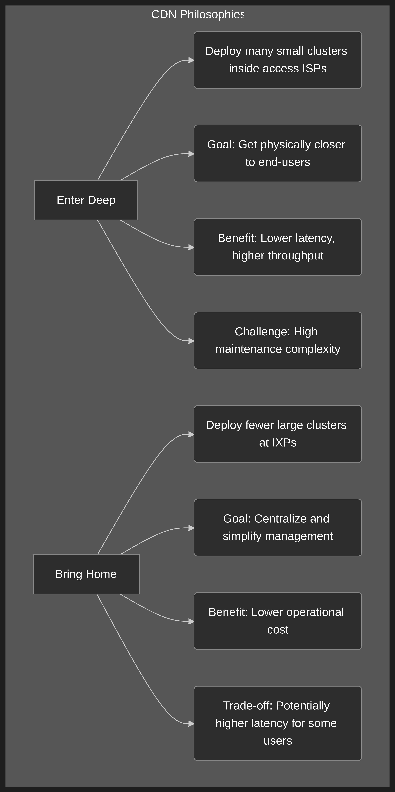

# Section 2.6 Review Questions: Video Streaming and CDNs

This document provides detailed answers to the review questions for Section 2.6, based on the context from "Computer Networking: A Top-Down Approach."

---

### **R24. CDNs typically adopt one of two different server placement philosophies. Name and briefly describe them.**

Content Distribution Networks (CDNs) use two main server placement philosophies to efficiently deliver content to users:

1.  **Enter Deep:** This philosophy involves deploying a large number of smaller server clusters deep into the access networks of Internet Service Providers (ISPs) all over the world.
    - **Goal:** To get as close as possible to end-users.
    - **Benefit:** This minimizes the network distance (number of links and routers) between the user and the CDN server, which significantly reduces latency and improves throughput.
    - **Challenge:** Managing and maintaining thousands of geographically dispersed server clusters is complex and costly.
    - **Pioneered by:** Akamai.

2.  **Bring Home:** This philosophy involves building fewer, but much larger, server clusters at key Internet Exchange Points (IXPs). Instead of going deep into access networks, this approach brings the ISPs "home" to the CDN's major data centers.
    - **Goal:** To simplify management and reduce operational overhead.
    - **Benefit:** It is easier and cheaper to maintain a smaller number of large data centers.
    - **Trade-off:** This may result in slightly higher delay and lower throughput for some end-users compared to the "Enter Deep" approach, as the server is not as close to the user.
    - **Used by:** Companies like Limelight.

---

### **R25. Besides network-related considerations such as delay, loss, and bandwidth performance, there are other important factors that go into designing a CDN server selection strategy. What are they?**

While network performance metrics are crucial, a CDN's cluster selection strategy—the mechanism for directing a client to the best server—must also consider other important factors. Based on the text, these include:

1.  **Geographic Proximity:** A simple and common strategy is to map the client's Local DNS (LDNS) server to a geographic location and direct the client to the geographically closest CDN cluster. While not always the best in terms of network path, it works reasonably well for a large fraction of clients.

2.  **Handling Remotely Located LDNS:** A significant challenge is that some users are configured to use LDNS servers that are geographically very far from their actual location. A purely geo-based selection would perform poorly in this case, sending the user to a CDN cluster close to their DNS server but far from them.

3.  **Real-time Network Conditions:** A more advanced strategy involves performing real-time measurements of network performance between clusters and clients (or their LDNS). This allows the CDN to account for current traffic conditions and route clients to a server that is performing best at that moment, not just the one that is geographically closest.

4.  **Load Balancing:** Even if one cluster is the "best" for a client based on geography or performance, it's important to distribute traffic across multiple clusters to prevent any single one from becoming overloaded. The text mentions that YouTube (via Google's CDN) sometimes directs a client to a more distant cluster specifically to balance the load.
