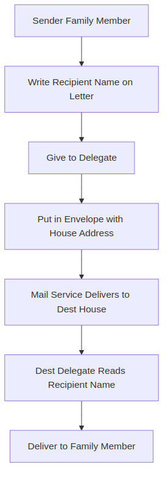
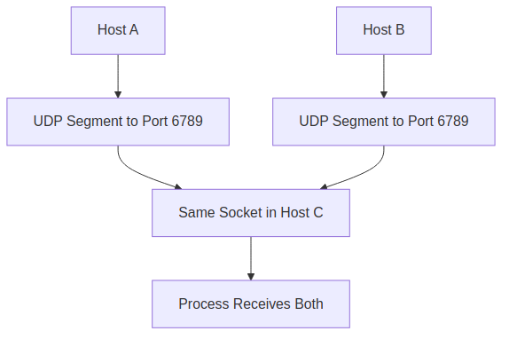

# Sections 3.1–3.3 Review Questions Answers

Welcome to the answers for Sections 3.1–3.3 review questions! These sections cover the transport layer in computer networking, which is like the "delivery service" that ensures data from one application on one computer reaches the right application on another computer. Think of it as the postal service for the internet. We'll explain everything step-by-step, assuming you're new to networking. All answers come from the textbook "Computer Networking: A Top-Down Approach" by Kurose and Ross, based on the provided PDF. We'll include simple examples, diagrams (as images), and clear explanations so beginners can follow along easily.

## R1. Suppose the network layer provides the following service. The network layer in the source host accepts a segment of maximum size 1,200 bytes and a destination host address from the transport layer. The network layer then guarantees to deliver the segment to the transport layer at the destination host. Suppose many network application processes can be running at the destination host.

**What this question is asking:** Imagine the network layer (which handles routing data across the internet) guarantees delivery of data packets to the right computer. But on that computer, multiple apps might be running (like a web browser and email client). We need a simple way to get the data to the correct app.

### a. Design the simplest possible transport-layer protocol that will get application data to the desired process at the destination host. Assume the operating system in the destination host has assigned a 4-byte port number to each running application process.

**Explanation for beginners:** The transport layer sits between the application (like your browser) and the network layer (which sends data across the internet). Its job is to make sure data goes from one app on one computer to the right app on another computer. Since the network layer already guarantees delivery to the computer, we just need to add a "label" to say which app should get the data.

- **How it works (simple protocol design):**
  - When sending data, the transport layer adds a 4-byte "port number" (like a house number for apps) to the front of the data. This creates a "segment" (a packet with extra info).
  - The network layer sends this segment to the destination computer.
  - At the destination, the transport layer looks at the port number and gives the data to the matching app's "socket" (a doorway for data).
  - We don't need fancy features like error checking because the network layer handles reliability.

This is like a basic version of UDP (User Datagram Protocol), which is simple and fast but doesn't guarantee perfect delivery.

### b. Modify this protocol so that it provides a "return address" to the destination process.

**Explanation:** Now, we want the receiving app to know how to reply back. We add the sender's port number too.

- **Modified design:**
  - Add both sender's port (4 bytes) and receiver's port (4 bytes) to the data.
  - The receiving app gets the data and knows the sender's port for replies.
  - It's like including your return address on a letter so the recipient can write back.

### c. In your protocols, does the transport layer "have to do anything" in the core of the computer network?

**Explanation:** The "core" means the middle of the network (routers and cables that connect computers). The transport layer only works at the ends (your computer and the destination computer). Routers in the middle just forward data based on IP addresses (like street addresses). The transport layer doesn't touch the core—it follows the "end-to-end principle," meaning complex stuff happens only at the edges.

### Diagram: Simple Transport Protocol

This flowchart shows how data flows: from app → transport layer (adds port) → network layer (delivers) → transport layer (checks port) → app.

## R2. Consider a planet where everyone belongs to a family of six, every family lives in its own house, each house has a unique address, and each person in a given house has a unique name. Suppose this planet has a mail service that delivers letters from source house to destination house. The mail service requires that (1) the letter be in an envelope, and that (2) the address of the destination house (and nothing more) be clearly written on the envelope. Suppose each family has a delegate family member who collects and distributes letters for the other family members. The letters do not necessarily provide any indication of the recipients of the letters.

**What this question is asking:** This is an analogy to networking. Families are like computers, houses are like IP addresses, and people are like apps/processes. The mail service is like the network layer (delivers to houses). We need a way for family "delegates" (like the transport layer) to get letters to the right person in the house.

### a. Using the solution to Problem R1 above as inspiration, describe a protocol that the delegates can use to deliver letters from a sending family member to a receiving family member.

**Explanation:** Just like in R1 where we added port numbers to data, here we add the recipient's name to the letter.

- **Protocol steps:**
  - The sender (family member) writes the recipient's name on the letter and gives it to the delegate.
  - The delegate puts the letter in an envelope and writes only the destination house address on it (as required by mail rules).
  - The mail service delivers the envelope to the destination house's delegate.
  - The destination delegate opens the envelope, sees the recipient's name, and gives the letter to that family member.

This ensures the letter gets to the right person without the mail service needing to know who's inside.

### b. In your protocol, does the mail service ever have to open the envelope and examine the letter in order to provide its service?

**Explanation:** No! The mail service only looks at the house address on the outside of the envelope. It doesn't open the envelope or read the letter (which has the recipient's name). This is like how the network layer doesn't look at transport-layer data—it just delivers to the computer.

### Diagram: Mail Service Analogy

This diagram shows the flow: sender → delegate (adds house address) → mail service (delivers) → delegate (reads name) → recipient.

## R3. Consider a TCP connection between Host A and Host B. Suppose that the TCP segments traveling from Host A to Host B have source port number x and destination port number y. What are the source and destination port numbers for the segments traveling from Host B to Host A?

**What this question is asking:** TCP (Transmission Control Protocol) is like a reliable phone call between computers. When data goes from A to B, it has "source" (sender's) and "destination" (receiver's) port numbers. For replies from B to A, these flip.

**Explanation:** Port numbers are like phone extensions. In a two-way conversation, the sender becomes the receiver and vice versa.

- For segments going from B back to A:
  - Source port (B's port): y (this was originally A's destination port).
  - Destination port (A's port): x (this was originally B's source port).

It's like swapping caller and receiver IDs in a phone call.

### Diagram: TCP Port Inversion

This shows how ports flip: A to B (x→y) becomes B to A (y→x).

## R4. Describe why an application developer might choose to run an application over UDP rather than TCP.

**What this question is asking:** TCP and UDP are two ways to send data over the internet. TCP is reliable (like registered mail), UDP is fast but unreliable (like regular mail). Why pick UDP?

**Explanation for beginners:** Think of TCP as a careful delivery service that waits for confirmations and avoids traffic jams. UDP is like a speedy courier that doesn't wait—it just sends and hopes for the best. Developers choose UDP when speed matters more than perfection.

- **No connection setup**: UDP doesn't do the "handshake" (like saying "hello" before talking) that TCP does, so it's faster to start. Great for quick queries like DNS (finding website addresses).
- **No memory of connections**: UDP doesn't track who's talking, so servers can handle thousands of users at once without getting overloaded.
- **Full control for the app**: The app decides when and how fast to send data, without TCP slowing it down to avoid network congestion.
- **Smaller data overhead**: UDP adds only 8 bytes of info to each packet, vs. TCP's 20 bytes—less "baggage."

Use UDP for things like video calls or games where a little data loss is okay, but delays aren't.

### Diagram: UDP vs TCP Comparison

This pie chart shows the advantages: UDP wins on speed and simplicity, TCP on reliability.

## R5. Why is it that voice and video traffic is often sent over TCP rather than UDP in today's Internet? *(Hint: The answer we are looking for has nothing to do with TCP's congestion-control mechanism.)*

**What this question is asking:** UDP seems perfect for video calls or streaming because it's fast and doesn't care about perfect delivery. But sometimes TCP is used instead. Why? (The hint says it's not about TCP's way of managing traffic jams.)

**Explanation:** Firewalls and security systems on networks (like corporate or school Wi-Fi) often block UDP packets because they're "unreliable" and could be used for attacks. TCP packets look safer, so they get through. Also, TCP's built-in reliability (resending lost data) and ordering (keeping data in sequence) help with video quality in some cases. So, even though UDP is faster, TCP ensures the data actually arrives when networks are picky.

## R6. Is it possible for an application to enjoy reliable data transfer even when the application runs over UDP? If so, how?

**What this question is asking:** UDP doesn't guarantee data arrives safely or in order. Can an app still be reliable if it uses UDP?

**Explanation:** Yes! The app can add its own "safety features" on top of UDP. Think of UDP as a basic truck that might lose packages— the app adds tracking and redelivery.

- **How:** The app includes "acknowledgments" (like "got it!" messages), sequence numbers (to keep data in order), and retransmission (resend if lost). Protocols like QUIC (used in fast web browsing) do this—they build TCP-like reliability right into the app layer, using UDP underneath for speed.

## R7. Suppose a process in Host C has a UDP socket with port number 6789. Suppose both Host A and Host B each send a UDP segment to Host C with destination port number 6789.

**What this question is asking:** A computer (Host C) has an app listening on port 6789. Two other computers (A and B) send data to that port. Does it all go to the same "doorway" in the app?

### Will both of these segments be directed to the same socket at Host C?

**Explanation:** Yes, both packets go to the same socket. UDP sockets are like labeled doors identified by the destination computer's IP and the port number. Since both packets target the same IP/port, they enter the same door.

### If so, how will the process at Host C know that these two segments originated from two different hosts?

**Explanation:** The app gets extra info with each packet: the sender's IP address and port number. Using the recvfrom() function (in programming), the app can check "who sent this?" and handle data from A and B separately, even though they arrived at the same socket.

## R8. Suppose that a Web server runs in Host C on port 80. Suppose this Web server uses persistent connections, and is currently receiving requests from two different Hosts, A and B.

**What this question is asking:** A web server (like for websites) listens on port 80. It uses "persistent connections" (keeps the connection open for multiple requests, like reusing a phone line). Two users (from computers A and B) are sending requests. Do all requests use the same "socket" (connection point) on the server?

### Are all of the requests being sent through the same socket at Host C?

**Explanation:** No. Each TCP connection gets its own socket. Persistent connections mean one connection can handle multiple requests (like multiple emails on one call), so those requests share that socket. But different users (A and B) have separate connections, so separate sockets.

### If they are being passed through different sockets, do both of the sockets have port 80?

**Explanation:** Yes, every socket for the web server uses port 80 as the destination. But TCP distinguishes sockets by four things: source IP, source port, destination IP, destination port. So, even with the same dest port (80), sockets from A and B are unique.

### Diagram: Web Server Sockets

This flowchart shows: Host A and B connect to Host C's port 80, each getting their own socket for persistent requests.