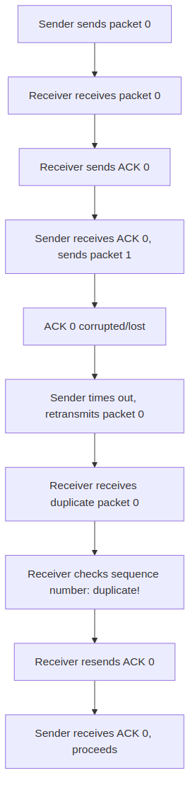
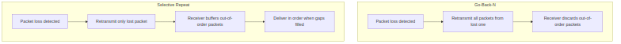

# Section 3.4 Review Questions Answers

Based on the context from Section 3.4 "Principles of Reliable Data Transfer" of "Computer Networking: A Top-Down Approach" by Kurose and Ross, here are the answers to the review questions R9 through R13. Each answer is explained clearly, with relevant examples, theory, and diagrams where they enhance visualization and understanding.

---

## R9. In our rdt protocols, why did we need to introduce sequence numbers?

### Explanation
In our reliable data transfer (rdt) protocols, **sequence numbers** were introduced to handle the problem of duplicate packets that could arrive at the receiver. As we evolved the protocols from rdt1.0 (perfect channel) to rdt2.0 (channel with bit errors), we added error detection, positive acknowledgments (ACKs), and negative acknowledgments (NAKs).

However, in rdt2.0, if an ACK or NAK packet itself became corrupted, the sender couldn't distinguish whether the original data packet was received correctly or not. To solve this, the sender would retransmit the data packet whenever it received a corrupted ACK or NAK.

### The Problem: Duplicate Packets
This retransmission could lead to **duplicate data packets** arriving at the receiver. Without sequence numbers, the receiver would have no way to tell whether an arriving packet was a new packet or a duplicate retransmission.

### The Solution: Sequence Numbers
**Sequence numbers** solve this by allowing the receiver to check if the packet's sequence number matches what it expects. If it's a duplicate (sequence number already seen), it can be safely ignored.

### Example in rdt2.1
For example, in rdt2.1, we introduced **1-bit sequence numbers** (0 or 1), alternating between packets. This allows the receiver to detect duplicates and handle corrupted ACKs/NAKs properly.

### Importance in Advanced Protocols
In more advanced protocols like rdt3.0 and pipelined protocols (Go-Back-N and Selective Repeat), sequence numbers become even more crucial for managing multiple packets in flight and detecting out-of-order delivery.

### Diagram: Sequence Numbers Handling Duplicates

*Figure: Flowchart showing how sequence numbers prevent confusion between new packets and retransmitted duplicates.*

## R10. In our rdt protocols, why did we need to introduce timers?

### Explanation
In our rdt protocols, **timers** were introduced in rdt3.0 to handle packet losses in addition to bit errors. While rdt2.2 could handle bit errors and corrupted ACKs/NAKs, it assumed that all transmitted packets would eventually be received (possibly corrupted, but received).

### The Problem: Packet Losses
In real networks, packets can be **completely lost** due to:
- Buffer overflows at routers
- Link failures
- Network congestion
- Other transmission issues

### The Issue Without Timers
Without timers, if a data packet or its ACK was lost, the sender would **wait indefinitely** for a response that would never come, causing the protocol to **deadlock**.

### The Solution: Timeout Mechanism
**Timers** provide a timeout mechanism:
- When a packet is sent, a timer is started
- If the timer expires before an ACK is received, the sender assumes the packet (or ACK) was lost and retransmits the packet

### Example in rdt3.0
For instance, in rdt3.0:
- The sender sets a timer when sending a packet
- If the ACK arrives before timeout, the timer is stopped and the next packet is sent
- If timeout occurs, the packet is retransmitted and the timer restarted

This ensures **reliable delivery** even over lossy channels.

### Diagram: Timer Mechanism for Loss Recovery

*Figure: Sequence diagram showing how timers detect packet losses and trigger retransmissions.*

## R11. Suppose that the roundtrip delay between sender and receiver is constant and known to the sender. Would a timer still be necessary in protocol rdt 3.0, assuming that packets can be lost? Explain.

### Answer: Yes, timers are still necessary.

### Explanation
Even if the **roundtrip time (RTT)** is constant and known, **timers are still essential** because packet losses can still occur.

### Why Timers Are Needed
- **Data packet loss**: If a data packet is lost, no ACK will ever be sent, so the sender would wait forever without a timer
- **ACK packet loss**: If an ACK packet is lost, the sender would also wait indefinitely for a response that won't come

### The Role of Timers
The **timer provides a safety mechanism** to break this deadlock. By setting the timeout to slightly longer than the known RTT (to account for processing delays), the sender can detect losses and initiate retransmissions.

### Conclusion
Without timers, the protocol would **fail whenever packets are lost**, regardless of how well the RTT is known. Timers are crucial for robustness in unreliable networks.

## R12. Visit the Go-Back-N interactive animation at the companion Web site.

### a. Have the source send five packets, and then pause the animation before any of the five packets reach the destination. Then kill the first packet and resume the animation. Describe what happens.

In **Go-Back-N (GBN)**, the sender can transmit multiple packets without waiting for ACKs, up to the window size N.

**When packet 0 is lost:**
- Packets 1-4 arrive out of order at the receiver
- The receiver **discards** these out-of-order packets
- Sends a cumulative ACK for the last in-order packet received (ACK 0, since none are in order)
- The sender, having not received ACK 0, **times out** on packet 0
- **Retransmits** packets 0, 1, 2, 3, and 4 (the "go-back-N" behavior)
- The receiver then accepts packet 0, sends ACK 1, and the process continues

### b. Repeat the experiment, but now let the first packet reach the destination and kill the first acknowledgment. Describe again what happens.

**When packet 0 reaches the receiver:**
- It sends ACK 0
- But if ACK 0 is **killed (lost)**, the sender doesn't receive it
- The sender **times out** on packet 0 and retransmits it
- The receiver receives the duplicate packet 0, recognizes it as a duplicate (using sequence numbers), sends **another ACK 0**
- The protocol continues normally

### c. Finally, try sending six packets. What happens?

Assuming a window size of N=4:
- The sender transmits packets 0-3 and waits for ACKs
- When ACK 0 arrives, it **slides the window** and sends packet 4
- If ACK 1 arrives, it sends packet 5
- With six packets, the sender manages them in **windows**: first 0-3, then 4-5 as ACKs arrive

## R13. Repeat R12, but now with the Selective Repeat interactive animation. How are Selective Repeat and Go-Back-N different?

### Key Differences Between Selective Repeat (SR) and Go-Back-N (GBN)

#### 1. Retransmission Strategy
- **GBN**: If a packet is lost, **all subsequent packets in the window are retransmitted** (go-back-N)
- **SR**: Only the **lost packet is retransmitted individually**

#### 2. Receiver Buffering
- **GBN**: Receiver **discards out-of-order packets**
- **SR**: Receiver **buffers out-of-order packets** until missing ones arrive, then delivers them in order

#### 3. Window Management
- **Both use sliding windows**, but SR requires larger windows and more complex receiver logic to handle reordering

#### 4. Efficiency
- **SR** is more efficient for lossy channels as it avoids unnecessary retransmissions
- **SR** requires more buffer space and processing at the receiver

### Animation Experiments Results

#### a. Packet 0 lost
- Packets 1-4 are **buffered** at the receiver
- Only packet 0 is retransmitted when it times out

#### b. ACK 0 lost
- Lost ACK 0 causes timeout and retransmission of packet 0
- Receiver handles it as duplicate

#### c. Six packets
- Six packets are **managed individually**
- Lost packets are retransmitted **without affecting others**

### Diagram: GBN vs SR Comparison

*Figure: Comparison of retransmission strategies in Go-Back-N and Selective Repeat protocols.*