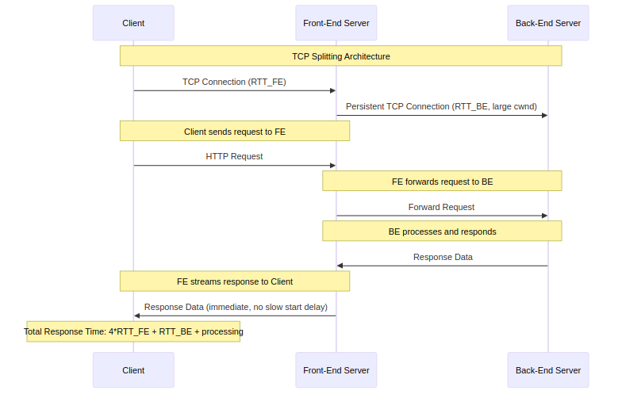

# Section 3.7 Review Questions Answers

Based on the context from Section 3.7 "TCP Congestion Control" of "Computer Networking: A Top-Down Approach" by Kurose and Ross, here are the answers to the review questions R17, R18, and R19. Each answer is explained clearly, with relevant examples, and visualizations where they enhance understanding.

---

## R17. Transmission Rates for Two TCP Connections

**Question:**
Suppose two TCP connections are present over some **bottleneck link** of rate **R bps**. Both connections have a huge file to send (in the same direction over the bottleneck link). The transmissions of the files start at the same time. What transmission rate would TCP like to give to each of the connections?

**Answer:**
TCP aims for **fair sharing** of the bottleneck link bandwidth. With TCP's Additive Increase Multiplicative Decrease (AIMD) algorithm, when two connections share a bottleneck link of rate _R_ bps, each connection will eventually converge to receive approximately **R/2 bps** (half the link capacity).

### Detailed Explanation

- **Fairness in TCP**: TCP uses AIMD to ensure multiple connections sharing the same bottleneck link get roughly equal shares of available bandwidth, preventing any single connection from dominating the link.
- **How AIMD Works**:
  1. Both connections start with slow start, rapidly increasing their congestion window (_cwnd_) until a loss event occurs.
  2. When loss happens, they reduce their rates multiplicatively (by half) and then increase additively until the next loss.
  3. This "sawtooth" behavior converges to each connection getting _R_/2.
- **Why R/2?**: For two connections, the total bandwidth _R_ is divided equally. For _N_ connections, each gets approximately _R/N_.
- **Real-World Considerations**: Factors like different Round-Trip Times (RTTs) or connection start times can cause slight variations, but TCP's AIMD generally achieves fair sharing.

### Visualization

_Figure: This diagram illustrates how TCP connections share bottleneck bandwidth fairly through AIMD behavior._

---

## R18. True or False: ssthresh on Timer Expiration

**Question:**
**True or false?** Consider congestion control in TCP. When the timer expires at the sender, the value of **ssthresh** is set to one half of its previous value.

**Answer: False**

### Detailed Explanation

In TCP congestion control, when a **timeout** occurs (indicating severe congestion), the sender:

1. Sets the **congestion window (cwnd)** to 1 MSS (Maximum Segment Size).
2. Sets the **slow start threshold (ssthresh)** to **half of the current cwnd value** when the timeout occurred, **not half of its previous value**.

**Example**: If _cwnd_ was 12 MSS when the timeout happened, _ssthresh_ is set to 6 MSS (12/2), and _cwnd_ is reset to 1 MSS.

**Key Points**:

- Timeout indicates severe congestion (packet loss without duplicate ACKs).
- Triple duplicate ACKs (fast retransmit) also set _ssthresh_ to half the current _cwnd_, but handle _cwnd_ differently.
- This aggressive reduction helps TCP back off significantly during congestion.

---

## R19. Justifying TCP Splitting Response Time

**Question:**
In the discussion of **TCP splitting** in the sidebar in Section 3.7, it was claimed that the response time with TCP splitting is approximately: **4 × RTT_FE + RTT_BE + processing time**. Justify this claim.

**Answer:**
TCP splitting reduces response time by deploying front-end servers close to clients and maintaining persistent connections to back-end data centers. The formula _4 × RTT_FE + RTT_BE + processing time_ derives from TCP slow start dynamics in this architecture.

### Step-by-Step Justification

1. **TCP Splitting Architecture**:
   - **Front-end (FE)**: Server close to client (small _RTT_FE_).
   - **Back-end (BE)**: Data center server (_RTT_BE_ could be large).
   - Client establishes TCP connection to FE.
   - FE maintains persistent TCP connection to BE with large congestion window.

2. **Response Time Breakdown**:
   - **Client to FE Connection**: ~_RTT_FE_ for TCP handshake + slow start.
   - **Data Transfer from BE to FE**: Quick (~_RTT_BE_) due to large _cwnd_ at FE.
   - **Data Transfer from FE to Client**: Immediate, as FE has data ready.

3. **The 4 × RTT_FE Factor**:
   - TCP slow start requires ~3 RTTs to deliver response data (3 window doublings).
   - Plus 1 RTT for initial connection setup.
   - Total: _4 × RTT_FE_ for client-FE interaction.

4. **RTT_BE**: Time for FE to get response from BE (minimal due to persistent connection).

5. **Processing Time**: Time for BE to process the request.

**Comparison**: Without TCP splitting, response time would be ~_4 × (RTT_FE + RTT_BE) + processing_, much larger for distant clients.

### Visualization

_Figure: This sequence diagram shows how TCP splitting reduces networking delay from ~4×RTT to ~RTT + processing time._

---
