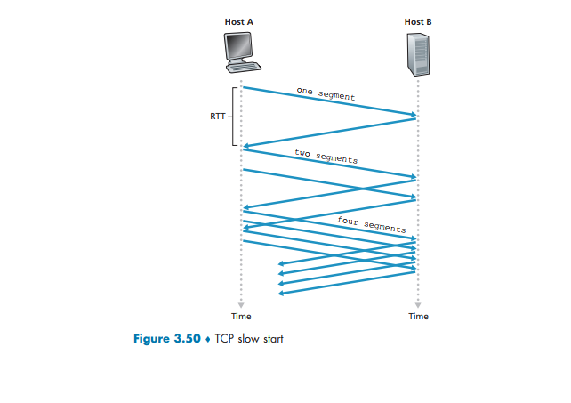

# Networking Problems and Solutions

## Table of Contents

- P1. Telnet Session Port Numbers
- P2. Figure 3.5 Analysis
- P3. UDP and TCP Checksum
- P4. 1's Complement Practice
- P5. UDP Checksum Certainty

## P1. Telnet Session Port Numbers

Suppose Client A initiates a Telnet session with Server S. At about the same time, Client B also initiates a Telnet session with Server S.

Provide possible source and destination port numbers for:

a. The segments sent from A to S.
b. The segments sent from B to S.
c. The segments sent from S to A.
d. The segments sent from S to B.
e. If A and B are different hosts, is it possible that the source port number in the segments from A to S is the same as that from B to S?
f. How about if they are the same host?

---

### Solution

#### Background

*   **Telnet:** A protocol used for remote login. It traditionally uses **port 23** on the server side.
*   **Client (Source) Port:** When a client initiates a connection, it uses an ephemeral (temporary) port number, typically chosen from a high range (e.g., > 1023, often > 49151). This port is unique for that specific session on the client machine.
*   **Server (Destination) Port:** The server listens for incoming connections on a well-known port. For Telnet, this is port 23.

Let's assume:
*   Client A has IP address `IP_A`.
*   Client B has IP address `IP_B`.
*   Server S has IP address `IP_S`.

#### a. Segments from A to S

*   **Source Port:** An ephemeral port number chosen by Client A. Let's say `51000`.
*   **Destination Port:** The well-known port for Telnet, which is `23`.

So, a possible combination is: **Source Port: 51000, Destination Port: 23**.

#### b. Segments from B to S

*   **Source Port:** An ephemeral port number chosen by Client B. It must be different from Client A's if they are on the same host, but can be the same if they are on different hosts. Let's pick `52000`.
*   **Destination Port:** The Telnet port, `23`.

So, a possible combination is: **Source Port: 52000, Destination Port: 23**.

#### c. Segments from S to A

When the server sends data back to the client, the source and destination ports are swapped.

*   **Source Port:** The port on the server that is communicating with Client A. This is the Telnet port, `23`.
*   **Destination Port:** The ephemeral port that Client A used to initiate the connection, `51000`.

So, a possible combination is: **Source Port: 23, Destination Port: 51000**.

#### d. Segments from S to B

Similarly, for the communication back to Client B:

*   **Source Port:** The Telnet port on the server, `23`.
*   **Destination Port:** The ephemeral port that Client B used, `52000`.

So, a possible combination is: **Source Port: 23, Destination Port: 52000**.

#### e. If A and B are different hosts?

**Yes, it is possible.**

If Client A (at `IP_A`) and Client B (at `IP_B`) are on different machines, their choice of source port is independent. Both could happen to choose the same ephemeral port number, for example, `51500`.

The server can still distinguish between the two sessions because the full socket address is a combination of **(Source IP, Source Port)**.
*   Session 1: (`IP_A`, `51500`)
*   Session 2: (`IP_B`, `51500`)

Since `IP_A` and `IP_B` are different, the server sees two unique connections and can manage them separately.

#### f. If A and B are the same host?

**No, it is not possible.**

If both clients are processes running on the same host (same IP address), the operating system must assign a unique source port number to each distinct connection. A connection is uniquely identified by the 4-tuple: (Source IP, Source Port, Destination IP, Destination Port).

If both sessions used the same source port:
*   Session 1: (`IP_A`, `51500`, `IP_S`, `23`)
*   Session 2: (`IP_A`, `51500`, `IP_S`, `23`)

These two tuples would be identical, and the host's networking stack would have no way to determine which application process (Client A or Client B) should receive an incoming packet from the server. Therefore, the operating system ensures each new connection from the same host to the same destination gets a unique source port.

## P2. Figure 3.5 Analysis



Consider Figure 3.5. What are the source and destination port values in the segments flowing from the server back to the clients’ processes? What are the IP addresses in the network-layer datagrams carrying the transport-layer segments?

*(Note: Figure 3.5 shows a web server (Host B) and a client (Host A). It depicts a web request, not Telnet.)*

---

### Solution

#### Background

*   **Web Server (HTTP):** Listens on the well-known port `80`.
*   **Client (Web Browser):** Initiates a connection from an ephemeral port.

Let's assume:
*   Client (Host A) has IP address `IP_A` and chooses ephemeral port `45000`.
*   Server (Host B) has IP address `IP_B` and listens on port `80`.

#### Segments from Client to Server (Request)

*   **Source IP:** `IP_A`
*   **Destination IP:** `IP_B`
*   **Source Port:** `45000`
*   **Destination Port:** `80`

#### Segments from Server to Client (Response)

This is the part the question asks about. The source and destination are swapped.

*   **Source Port:** The port the server is using for the connection, which is the HTTP port `80`.
*   **Destination Port:** The ephemeral port the client used to make the request, `45000`.
*   **Source IP Address:** The server's IP address, `IP_B`.
*   **Destination IP Address:** The client's IP address, `IP_A`.

So, for the segments flowing **from the server back to the client**:
*   **Source Port:** 80
*   **Destination Port:** 45000 (or some other ephemeral port chosen by the client)
*   **Source IP:** IP address of Host B
*   **Destination IP:** IP address of Host A

## P3. UDP and TCP Checksum

UDP and TCP use 1’s complement for their checksums. Suppose you have the following three 8-bit bytes: `01010011`, `01100110`, `01110100`.

What is the 1’s complement of the sum of these 8-bit bytes? (Note that although UDP and TCP use 16-bit words in computing the checksum, for this problem you are being asked to consider 8-bit sums.)

Show all work.

Why is it that UDP takes the 1’s complement of the sum; that is, why not just use the sum?

With the 1’s complement scheme, how does the receiver detect errors?
Is it possible that a 1-bit error will go undetected? How about a 2-bit error?

---

### Solution

#### 1. Calculating the 1's Complement Sum

**Step 1: Sum the bytes.**

```
   01010011
 + 01100110
 -----------
   10111001
```

Now, add the third byte to this result.

```
   10111001
 + 01110100
 -----------
 1 00101101  <-- Note the carry-out bit
```

**Step 2: Handle the carry-out (end-around carry).**

In 1's complement arithmetic, any carry-out from the most significant bit must be added back to the least significant bit.

```
   00101101
 +        1
 -----------
   00101110   <-- This is the sum.
```

**Step 3: Take the 1's complement of the sum.**

To get the 1's complement, we flip all the bits (0 becomes 1, and 1 becomes 0).

```
Original Sum: 00101110
Checksum:     11010001
```

The 1's complement of the sum is **`11010001`**.

#### 2. Why Use 1's Complement of the Sum?

The main reason is to **simplify error checking at the receiver**.

If the sender just sent the sum, the receiver would have to:
1.  Recalculate the sum of the received data.
2.  Compare its calculated sum with the sum received in the checksum field.

By sending the 1's complement of the sum (the checksum), the receiver's job becomes easier:
1.  The receiver sums all the received data, **including the checksum field itself**.
2.  If there are no errors, the result of this final sum will be a word of all 1s (`11111111` in our 8-bit example).

This is because `Sum + (1's Complement of Sum) = All 1s`. Checking if a value is all 1s is a very fast operation in hardware.

#### 3. How the Receiver Detects Errors

As described above:
1.  The receiver takes all the 16-bit words in the segment (header + data), including the checksum field.
2.  It computes the 1's complement sum of all these words.
3.  **If the result is `11111111...1` (all ones), the receiver assumes no errors occurred.**
4.  **If the result is anything other than all ones, the receiver knows an error has occurred** and discards the segment.

#### 4. Undetected Errors

*   **Is it possible that a 1-bit error will go undetected?**

    **No.** A single bit flip (e.g., a 0 becomes a 1) will change the final sum at the receiver, so the result will not be all 1s. The error will always be detected.

*   **Is it possible that a 2-bit error will go undetected?**

    **Yes, it is possible.** The checksum is not foolproof. If two bits are flipped in a way that they cancel each other out, the checksum will fail to detect the error.

    For example, consider a 16-bit word `00000000 00000001`.
    If the first bit is flipped to 1 and the last bit is flipped to 0, the word becomes `10000000 00000000`. The sum might not change in a way that is detectable.

    A more direct example:
    *   Suppose one word is `A = 0101...` and another is `B = 1010...`.
    *   If `A` is corrupted to `A' = 0001...` (a bit flipped from 1 to 0).
    *   And `B` is corrupted to `B' = 1110...` (a bit in the same position flipped from 0 to 1).
    *   The sum `A' + B'` might be the same as `A + B`, causing the error to go undetected.

    **Example from P4(c):** As shown in Problem 4 part (c), flipping corresponding bits in opposite directions in different bytes can leave the checksum unchanged.

## P4. 1's Complement Practice

a. Suppose you have the following 2 bytes: `01011100` and `01100101`. What is the 1’s complement of the sum of these 2 bytes?

b. Suppose you have the following 2 bytes: `11011010` and `01100101`. What is the 1’s complement of the sum of these 2 bytes?

c. For the bytes in part (a), give an example where one bit is flipped in each of the 2 bytes and yet the 1’s complement doesn’t change.

---

### Solution

#### a. `01011100` and `01100101`

**Step 1: Sum the bytes.**
```
  01011100
+ 01100101
-----------
  11000001
```
There is no carry-out, so this is the final sum.

**Step 2: Take the 1's complement.**
Flip all the bits of the sum.
```
Sum:      11000001
Checksum: 00111110
```
The 1's complement of the sum is **`00111110`**.

#### b. `11011010` and `01100101`

**Step 1: Sum the bytes.**
```
  11011010
+ 01100101
-----------
1 00111111  <-- Carry-out of 1
```

**Step 2: Handle the carry-out.**
Add the carry bit back to the result.
```
  00111111
+        1
-----------
  01000000
```
This is the final sum.

**Step 3: Take the 1's complement.**
Flip all the bits of the sum.
```
Sum:      01000000
Checksum: 10111111
```
The 1's complement of the sum is **`10111111`**.

#### c. Example of an Undetected 2-bit Error

We start with the bytes from part (a):
*   Byte 1: `01011100`
*   Byte 2: `01100101`
*   Their sum is `11000001`.

We need to flip one bit in each byte such that the new sum is still `11000001`.

Let's try flipping the **most significant bit (MSB)** in both bytes.
*   Flipping the MSB of Byte 1: `01011100` -> `11011100` (added 2^7)
*   Flipping the MSB of Byte 2: `01100101` -> `11100101` (this is wrong, we need to flip a 0 to 1 and a 1 to 0 in the same position)

Let's try a different approach. To keep the sum the same, if we **decrease** one number by a certain amount, we must **increase** the other number by the exact same amount.

Flipping a bit from `1` to `0` at position `i` decreases the value by `2^i`.
Flipping a bit from `0` to `1` at position `i` increases the value by `2^i`.

So, we need to find a bit position `i` where one byte has a `1` and the other has a `0`.

Let's look at the bytes again:
Byte 1: `01011100`
Byte 2: `01100101`

*   At the **MSB (bit 7)**, Byte 1 has `0` and Byte 2 has `0`. No good.
*   At **bit 6**, Byte 1 has `1` and Byte 2 has `1`. No good.
*   At **bit 5**, Byte 1 has `0` and Byte 2 has `1`. **This works!**

Let's flip the bit at position 5 (the 6th bit from the right, value 2^5 = 32).
*   **Original Byte 1:** `01011100`
*   **Original Byte 2:** `01100101`

Flip bit 5 in Byte 1 (0 -> 1):
*   **New Byte 1:** `01111100`

Flip bit 5 in Byte 2 (1 -> 0):
*   **New Byte 2:** `01000101`

Now, let's sum these new bytes:
```
  01111100
+ 01000101
-----------
  11000001
```
The sum is **identical** to the original sum. Therefore, the 1's complement checksum will also be identical, and this 2-bit error will go **undetected**.

## P5. UDP Checksum Certainty

Suppose that the UDP receiver computes the Internet checksum for the received UDP segment and finds that it matches the value carried in the checksum field. Can the receiver be absolutely certain that no bit errors have occurred? Explain.

---

### Solution

**No, the receiver cannot be absolutely certain that no bit errors have occurred.**

The UDP checksum mechanism can detect all 1-bit errors, but it cannot detect all possible multi-bit errors.

**Explanation:**

The checksum is calculated using 1's complement arithmetic. The fundamental weakness is that multiple errors can cancel each other out. If bit errors occur in the packet during transmission in such a way that the sum of all the 16-bit words remains the same, the checksum will still appear valid to the receiver.

**Example Scenario (as shown in P4.c):**

1.  Suppose a 16-bit word in the original data is `X`.
2.  Suppose another 16-bit word is `Y`.
3.  During transmission, `X` is corrupted and becomes `X'`, and `Y` is corrupted and becomes `Y'`.
4.  If the changes are "complementary"—for instance, a bit at position `i` is flipped from 1 to 0 in `X`, and the bit at the same position `i` is flipped from 0 to 1 in `Y`—the overall sum of all words in the segment might not change.

Since the sum remains the same, the checksum calculation at the receiver will produce a result of all 1s, leading the receiver to incorrectly conclude that the packet is error-free.

Therefore, while the checksum provides a good level of error detection, it is not an absolute guarantee of data integrity.