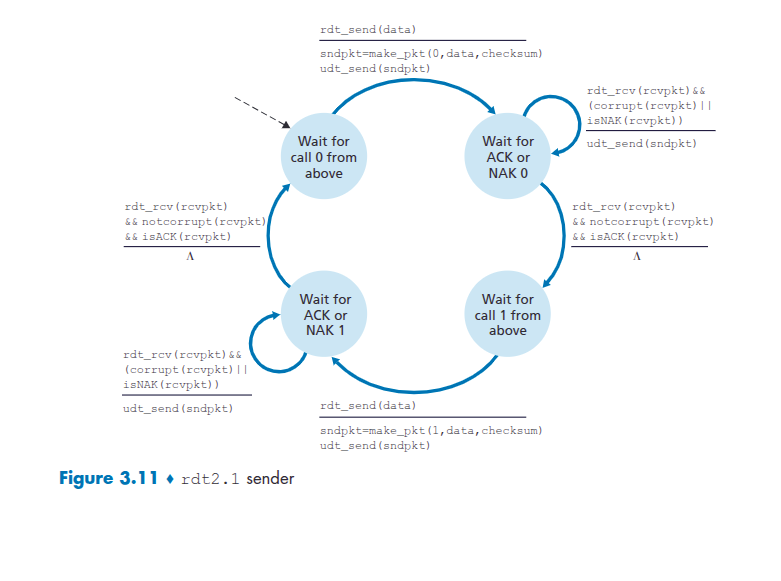
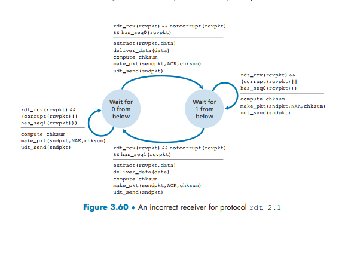

# Networking Problems and Solutions

## Table of Contents

- P6. rdt2.1 Deadlock Scenario
- P8. FSM for rdt3.0 Receiver
- P9. rdt3.0 Trace with Garbled Packets
- P10. Modifying rdt2.1 for a Lossy Channel
- P11. rdt2.2 Receiver Modification

## P6. rdt2.1 Deadlock Scenario





Consider our motivation for correcting protocol rdt2.1. Show that the receiver, shown in Figure 3.60, when operating with the sender shown in Figure 3.11, can lead the sender and receiver to enter into a deadlock state, where each is waiting for an event that will never occur.

---

### Solution

#### Protocol Components:

- **Sender (Figure 3.11 - `rdt2.1`):** A correct sender that uses sequence numbers (0 and 1) and waits for ACKs or NAKs. It retransmits the _current_ packet if it receives a corrupt or NAK response.
- **Receiver (Figure 3.60 - Incorrect `rdt2.1`):** An incorrect receiver that sends ACKs for correctly received packets and NAKs for corrupted or out-of-sequence packets.


#### The Deadlock Scenario

Let's trace a sequence of events where the **ACK/NAK from the receiver gets lost**.

**Initial State:**

- **Sender:** In "Wait for call 0 from above".
- **Receiver:** In "Wait for 0 from below".

**Step 1: Sender sends Packet 0**

- Sender gets data, creates `pkt0`, and sends it.
- Sender transitions to "Wait for ACK or NAK 0".

**Step 2: Receiver receives Packet 0 and sends ACK 0**

- Receiver gets `pkt0` (uncorrupted, correct sequence).
- It extracts the data, delivers it, and sends an `ACK` for packet 0.
- Receiver transitions to "Wait for 1 from below".

**Step 3: ACK 0 is Lost or Corrupted**

- The `ACK` packet sent by the receiver is lost or becomes corrupted on its way to the sender. The sender never receives a valid `ACK 0`.

**Step 4: Sender Times Out and Retransmits Packet 0**

- The sender, still in "Wait for ACK or NAK 0", has a timeout mechanism (implicit in `rdt2.1`'s design, explicit in `rdt2.2`/`rdt3.0`).
- The timeout occurs. The sender assumes `pkt0` or its `ACK` was lost.
- It retransmits `pkt0`.
- The sender remains in the "Wait for ACK or NAK 0" state.

**Step 5: Receiver Receives Duplicate Packet 0**

- The receiver is currently in the "Wait for 1 from below" state.
- It receives the retransmitted `pkt0`.
- According to its FSM (Figure 3.60), receiving a packet with `seq=0` while expecting `seq=1` is an error condition (`has_seq0(rcvpkt)` is true).
- The receiver sends a **`NAK`**.
- The receiver remains in the "Wait for 1 from below" state.

**Step 6: Sender Receives NAK and Retransmits Packet 0... Again**

- The sender is in "Wait for ACK or NAK 0".
- It receives the `NAK` from the receiver.
- According to its FSM (Figure 3.11), upon receiving a `NAK`, it retransmits the current packet (`pkt0`).
- The sender remains in the "Wait for ACK or NAK 0" state.

**The Deadlock:**

- The **Sender** is now stuck in a loop: It sends `pkt0`, receives a `NAK`, and retransmits `pkt0`. It will never move on to send `pkt1` because it never receives `ACK 0`.
- The **Receiver** is also stuck: It is in "Wait for 1 from below". Every time it receives the retransmitted `pkt0`, it sees it as a duplicate and sends a `NAK`. It will never receive `pkt1`.

Each side is waiting for the other to do something different, but based on their current states and the protocol logic, neither will change its behavior. The sender is waiting for an `ACK 0` that will never be sent again, and the receiver is waiting for a `pkt1` that the sender will never send. This is a deadlock.

## P8. FSM for rdt3.0 Receiver

Draw the FSM for the receiver side of protocol **rdt3.0**.

---

### Solution

The receiver for `rdt3.0` is actually identical to the receiver for `rdt2.2` (Figure 3.14). The `rdt3.0` protocol adds a timeout mechanism to the _sender_ to handle lost packets, but this change does not affect the receiver's logic. The receiver doesn't need to know about timeouts; it just responds to the packets it receives.

#### FSM for rdt3.0 Receiver

The FSM has two states:

1.  **Wait for 0 from below:** The receiver is expecting a packet with sequence number 0.
2.  **Wait for 1 from below:** The receiver is expecting a packet with sequence number 1.

Here is the diagram and logic:

#### State Descriptions:

**State: `Wait for 0 from below`**

- **Initial State.**
- **Event:** Receives a packet that is **not corrupt** and has **sequence number 0**.
  - **Action:** Extract data, deliver data to the upper layer, create an `ACK 0` packet, and send it.
  - **Transition:** Move to `Wait for 1 from below`.
- **Event:** Receives a packet that is **corrupt** OR has **sequence number 1**.
  - **Action:** This means either the packet is bad, or it's a duplicate `ACK` for a packet the sender hasn't received the `ACK` for yet. The receiver must re-acknowledge the _last correctly received packet_. Since it's waiting for 0, the last correct one was 1. So, it creates and sends an `ACK 1` packet.
  - **Transition:** Stay in `Wait for 0 from below`.

**State: `Wait for 1 from below`**

- **Event:** Receives a packet that is **not corrupt** and has **sequence number 1**.
  - **Action:** Extract data, deliver data, create an `ACK 1` packet, and send it.
  - **Transition:** Move to `Wait for 0 from below`.
- **Event:** Receives a packet that is **corrupt** OR has **sequence number 0**.
  - **Action:** The packet is bad or a duplicate. The receiver must re-acknowledge the last correctly received packet, which was 0. It creates and sends an `ACK 0` packet.
  - **Transition:** Stay in `Wait for 1 from below`.

This design ensures that the receiver correctly handles duplicates by re-sending the appropriate ACK, allowing the sender to move on.

## P9. rdt3.0 Trace with Garbled Packets


Give a trace of the operation of protocol **rdt3.0** when data packets and acknowledgment packets are garbled. Your trace should be similar to that used in Figure 3.16.

---

### Solution

This trace shows how `rdt3.0` (the alternating-bit protocol) handles both corrupted data packets and corrupted acknowledgment packets.

**Scenario:**

1.  Sender sends `pkt0`.
2.  `pkt0` is received correctly, and Receiver sends `ACK0`.
3.  Sender sends `pkt1`.
4.  `pkt1` gets corrupted during transmission.
5.  Receiver sends an `ACK` for the last correctly received packet (`ACK0`).
6.  Sender retransmits `pkt1`.
7.  `pkt1` is received correctly, and Receiver sends `ACK1`.
8.  `ACK1` gets corrupted during transmission.
9.  Sender times out and retransmits `pkt1`.
10. Receiver gets the duplicate `pkt1` and re-sends `ACK1`.
11. `ACK1` is received correctly, and the process continues.

#### Timeline Trace

```
      SENDER                                     RECEIVER
      ------                                     --------

      [State: Wait for call 0]
      rdt_send(data)
      sndpkt = make_pkt(0, data, chksum)
      start_timer
      udt_send(sndpkt)
         -------------------- pkt0 ------------------->
                                                   [State: Wait for 0]
                                                   rcv pkt0 (not corrupt, seq=0)
                                                   extract(pkt0, data)
                                                   deliver_data(data)
                                                   sndpkt = make_pkt(ACK, 0, chksum)
                                                   udt_send(sndpkt)
         <-------------------- ACK0 -------------------

      rcv ACK0 (not corrupt)
      stop_timer
      [State: Wait for call 1]
      rdt_send(data)
      sndpkt = make_pkt(1, data, chksum)
      start_timer
      udt_send(sndpkt)
         ----------------- pkt1 (corrupted) X ------->
                                                   [State: Wait for 1]
                                                   rcv pkt (corrupt)
                                                   // Receiver does nothing to the
                                                   // corrupted packet itself, but
                                                   // rdt2.2 logic implies re-acking
                                                   // the last good packet.
                                                   sndpkt = make_pkt(ACK, 0, chksum)
                                                   udt_send(sndpkt)
         <-------------------- ACK0 -------------------

      rcv ACK0 (not corrupt, but wrong seq)
      // Sender ignores ACK0 because it's waiting for ACK1.
      // It does nothing and continues to wait.

      ...timeout!
      // Sender's timer for pkt1 expires.
      retransmit pkt1
      start_timer
      udt_send(sndpkt)
         -------------------- pkt1 ------------------->
                                                   [State: Wait for 1]
                                                   rcv pkt1 (not corrupt, seq=1)
                                                   extract(pkt1, data)
                                                   deliver_data(data)
                                                   sndpkt = make_pkt(ACK, 1, chksum)
                                                   udt_send(sndpkt)
         <----------------- ACK1 (corrupted) X -------

      rcv pkt (corrupt)
      // Sender ignores the corrupted ACK.
      // It does nothing and continues to wait.

      ...timeout!
      // Sender's timer for pkt1 expires again.
      retransmit pkt1
      start_timer
      udt_send(sndpkt)
         -------------------- pkt1 ------------------->
                                                   [State: Wait for 0]
                                                   rcv pkt1 (duplicate)
                                                   // Receiver discards the duplicate
                                                   // data but must re-acknowledge.
                                                   sndpkt = make_pkt(ACK, 1, chksum)
                                                   udt_send(sndpkt)
         <-------------------- ACK1 -------------------

      rcv ACK1 (not corrupt)
      stop_timer
      [State: Wait for call 0]
      // Process continues...
```

## P10. Modifying rdt2.1 for a Lossy Channel

Consider a channel that can lose packets but has a maximum delay that is known. Modify protocol **rdt2.1** to include sender timeout and retransmit. Informally argue why your protocol can communicate correctly over this channel.

---

### Solution

The protocol described is essentially `rdt3.0`, but simplified because we know the channel does not corrupt packets, it only loses them. `rdt2.1` already handles bit errors with ACKs/NAKs, but it has no mechanism for loss.

#### Modified Protocol (rdt2.1 + Timeout)

**Sender Side FSM:**

The sender FSM is based on `rdt2.1` but with a timer added to each waiting state.

1.  **Wait for call 0 from above:**
    - On `rdt_send(data)`, create `pkt0`, send it, and **start a timer**.
    - Transition to `Wait for ACK/NAK 0`.

2.  **Wait for ACK/NAK 0:**
    - **Event:** Receive `ACK`.
      - **Action:** Stop the timer.
      - **Transition:** To `Wait for call 1 from above`.
    - **Event:** Receive `NAK`.
      - **Action:** Resend `pkt0`, restart the timer.
      - **Transition:** Stay in this state.
    - **Event:** **Timer expires (Timeout)**.
      - **Action:** Assume the packet or its acknowledgment was lost. Resend `pkt0`, restart the timer.
      - **Transition:** Stay in this state.

3.  **Wait for call 1 from above:** (Symmetrical to state 1)
    - On `rdt_send(data)`, create `pkt1`, send it, and **start a timer**.
    - Transition to `Wait for ACK/NAK 1`.

4.  **Wait for ACK/NAK 1:** (Symmetrical to state 2)
    - Handles `ACK`, `NAK`, and **Timeout** for `pkt1`.

**Receiver Side FSM:**

The receiver does not need to be modified from `rdt2.1`. It doesn't know about loss; it only reacts to received packets. When it receives a packet, it checks the sequence number.

- If it's the expected packet, it delivers the data and sends an `ACK`.
- If it's a duplicate packet (which will happen after a sender timeout and retransmission), it discards the data but still sends an `ACK` for that sequence number. This is crucial for the sender to break out of its wait-timeout-retransmit loop.
- (Since the channel doesn't corrupt, we don't need to worry about `NAK`s, but we can leave the logic in).

#### Informal Argument for Correctness

This protocol can communicate correctly because it handles the two possible problems on this channel: packet loss and duplicate packets.

1.  **Handling Data Packet Loss:**
    - If a data packet (e.g., `pkt0`) is lost, the receiver never gets it and sends no `ACK`.
    - The sender's timer will expire.
    - The sender retransmits `pkt0`.
    - Eventually, a copy of `pkt0` will get through, and the protocol can proceed.

2.  **Handling ACK Packet Loss:**
    - If the receiver gets `pkt0` and sends `ACK0`, but `ACK0` is lost, the sender will not be notified.
    - The sender's timer will expire.
    - The sender retransmits `pkt0`, thinking the original was lost.
    - The receiver gets the duplicate `pkt0`. Because it uses sequence numbers, it recognizes this as a duplicate, discards the data (preventing duplicate delivery to the application), but sends another `ACK0`.
    - This re-sent `ACK0` gives the sender a second chance to receive the acknowledgment and move on.

3.  **Preventing Duplicates:**
    - The core of the correctness lies in the **sequence numbers (0 and 1)**. The receiver uses the sequence number to distinguish between a new packet and a retransmitted duplicate. This ensures that data is delivered to the application **exactly once**.

Because the maximum delay is known, we can set a safe timeout value (greater than the maximum round-trip time) to avoid premature timeouts, making the system efficient and correct.

## P11. rdt2.2 Receiver Modification

Consider the **rdt2.2 receiver** in Figure 3.14, and the creation of a new packet in the self-transition in the _Wait-for-0-from-below_ and _Wait-for-1-from-below_ states:
`sndpkt = make_pkt(ACK,1,checksum)`
`sndpkt = make_pkt(ACK,0,checksum)`

Would the protocol work correctly if this action were removed from the self-transition in the _Wait-for-1-from-below_ state? Justify your answer.

What if this event were removed from the self-transition in the _Wait-for-0-from-below_ state? _Hint:_ In this latter case, consider what would happen if the first sender-to-receiver packet were corrupted.

---

### Solution

The action in the self-transition is to re-acknowledge the last correctly received packet when a corrupted or duplicate packet arrives. This is the mechanism that tells the sender "I got your last packet, please move on."

#### Case 1: Remove Action from `Wait-for-1-from-below`

The self-transition in this state is triggered by receiving a corrupted packet or a packet with `seq=0`. The action is `sndpkt = make_pkt(ACK, 0, checksum)`.

**If this action were removed, the protocol would FAIL.**

**Justification:**

1.  **Sender sends `pkt0`**. Receiver gets it, sends `ACK0`, and moves to `Wait-for-1-from-below`.
2.  **Sender receives `ACK0`**, sends `pkt1`, and moves to `Wait-for-ACK-for-1`.
3.  **`ACK0` from step 1 gets delayed and a duplicate arrives at the sender later**. Or, let's say the `ACK` for `pkt1` is lost and the sender times out and re-sends `pkt1`.
4.  Let's consider the case where `ACK0` is lost. Sender sends `pkt0`, receiver sends `ACK0` and moves to `Wait-for-1`. `ACK0` is lost. Sender times out and re-sends `pkt0`.
5.  The receiver is in `Wait-for-1-from-below` and receives the duplicate `pkt0`.
6.  The condition `rdt_rcv(rcvpkt) && (corrupt(rcvpkt) || has_seq0(rcvpkt))` is met.
7.  **With the action removed, the receiver does nothing.** It simply stays in the `Wait-for-1-from-below` state.
8.  The sender, however, is still waiting for an `ACK0`. Since the receiver did not re-send `ACK0`, the sender will time out again and re-send `pkt0` again.
9.  This will continue forever. The sender is stuck retransmitting `pkt0`, and the receiver is stuck waiting for `pkt1`, never re-sending the `ACK0` that the sender needs. This is a **deadlock**.

#### Case 2: Remove Action from `Wait-for-0-from-below`

The self-transition in this state is triggered by receiving a corrupted packet or a packet with `seq=1`. The action is `sndpkt = make_pkt(ACK, 1, checksum)`.

**If this action were removed, the protocol would also FAIL.**

**Justification (following the hint):**

1.  **Initial State:** Sender is `Wait-for-call-0`, Receiver is `Wait-for-0-from-below`.
2.  **Sender sends the very first packet, `pkt0`**.
3.  **This `pkt0` gets corrupted** during transmission.
4.  The receiver is in `Wait-for-0-from-below`. It receives a corrupted packet.
5.  The condition `rdt_rcv(rcvpkt) && (corrupt(rcvpkt) || has_seq1(rcvpkt))` is met.
6.  **With the action removed, the receiver does nothing.** It stays in `Wait-for-0-from-below`.
7.  The sender is in `Wait-for-ACK-for-0`. It never receives an `ACK` or `NAK` because the receiver did nothing.
8.  The sender's timer will eventually **time out**.
9.  The sender will retransmit `pkt0`.

In this specific scenario, the protocol _might_ eventually recover if the retransmitted `pkt0` arrives uncorrupted. However, the protocol is no longer robust.

Consider a more definitive failure case:

1. Sender sends `pkt0`, receiver gets it, sends `ACK0`, moves to `Wait-for-1`.
2. Sender gets `ACK0`, sends `pkt1`, moves to `Wait-for-ACK-1`.
3. Receiver gets `pkt1`, sends `ACK1`, moves to `Wait-for-0`.
4. **`ACK1` is lost.**
5. Sender times out, retransmits `pkt1`.
6. Receiver is in `Wait-for-0`. It receives the duplicate `pkt1`.
7. The condition `rdt_rcv(rcvpkt) && (corrupt(rcvpkt) || has_seq1(rcvpkt))` is met.
8. **With the action removed, the receiver does nothing.**
9. The sender will time out again and retransmit `pkt1`. This creates a **deadlock** just like in Case 1. The sender is stuck waiting for `ACK1`, but the receiver will never re-send it.
