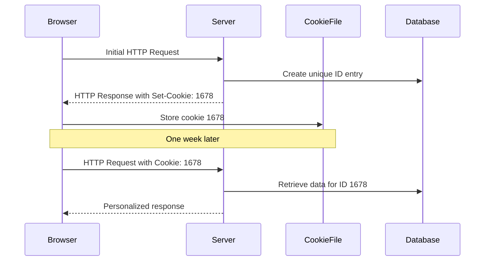

# Explanation of Pages 34-39: Maintaining User/Server State with Cookies

This document provides a detailed, easy-to-read explanation of the content from pages 34 to 39 of the lecture PDF on "Internet Architecture, TCP/IP Protocol Suite, IPC, Concept of Socket, HTTP 1.1, 2, 3, Cookies, Web Caching". The explanation is based solely on the provided text, with all technical terms defined, and includes Mermaid diagrams for better memorization.

## Stateless Nature of HTTP

HTTP (HyperText Transfer Protocol) is the application-layer protocol used for web communication. A key characteristic of HTTP is that it is **stateless**. This means:

- **No multi-step exchanges**: HTTP interactions do not involve a series of back-and-forth messages to complete a "transaction" (like purchasing an item online).
- **No state tracking**: Neither the client (browser) nor the server needs to remember or track the state of previous interactions.
- **Independence of requests**: Each HTTP request is completely independent of others.
- **No recovery needed**: If a transaction is partially completed but never finished, there's no need to recover from that state.

To illustrate, consider a stateful protocol where a client makes two changes to a variable X (from X to X' and then to X''). If the network connection or client crashes at time t' (after the first change), the system might be left in an inconsistent state, requiring recovery mechanisms.

In contrast, HTTP's statelessness avoids such issues.

## Why Cookies Are Needed

Despite HTTP's statelessness, many web applications need to maintain some form of state between interactions. For example:

- Remembering user preferences
- Keeping track of shopping cart contents
- Personalizing recommendations
- Managing user sessions (like in web email)

Cookies provide a way to add statefulness to otherwise stateless HTTP interactions.

## How Cookies Work

Cookies involve four main components:

1. **Cookie header line in HTTP response message**: The server sends a cookie to the client in the response.
2. **Cookie header line in HTTP request message**: The client includes the cookie in subsequent requests to the same server.
3. **Cookie file on user's host**: The browser stores cookies locally, managed by the user's browser.
4. **Back-end database at the web site**: The server stores data associated with each cookie ID.

### Example Scenario

Let's walk through an example with Susan visiting an e-commerce site for the first time:

1. Susan's browser sends an initial HTTP request to the site.
2. The server creates a unique ID (the "cookie") for Susan.
3. The server creates an entry in its back-end database for this ID.
4. The server responds with an HTTP response that includes a `Set-Cookie` header with the ID.
5. Susan's browser stores this cookie in a local cookie file.
6. On subsequent visits, Susan's browser includes the cookie in HTTP requests using a `Cookie` header.
7. The server uses this cookie to identify Susan and retrieve her information from the database.

The diagram shows the flow: initial setup, storage, and subsequent use of the cookie.

## Uses of Cookies

Cookies can be used for various purposes:

- **Authorization**: Verifying user login status across requests.
- **Shopping carts**: Remembering items added to cart.
- **Recommendations**: Personalizing content based on user behavior.
- **User session state**: Maintaining login state for web applications like email.

## Cookies and Privacy Concerns

While useful, cookies raise privacy issues:

- **First-party cookies**: Track user behavior on a single website.
- **Third-party cookies (tracking cookies)**: Allow tracking across multiple websites, even if the user never directly visits the tracker site.

Third-party tracking can be invisible to the user. For example, instead of a visible ad triggering an HTTP GET to a tracker, it could be an invisible link embedded in a webpage.

### Browser Policies on Third-Party Cookies

- **Firefox and Safari**: Disable third-party cookies by default.
- **Chrome**: Disabled third-party cookies in 2023.

### GDPR and Cookies

The EU's General Data Protection Regulation (GDPR) treats cookies that can identify individuals as personal data. Key points:

- Cookies are considered online identifiers that can be used to create profiles of natural persons.
- Users have explicit control over whether cookies are allowed.
- When cookies can identify an individual, they are subject to GDPR's personal data regulations.

## Challenge: How to Keep State

The text poses the challenge of maintaining state in a stateless protocol like HTTP. Two main approaches:

1. **At protocol endpoints**: Maintain state at the sender/receiver over multiple transactions.
2. **In messages**: Carry state information within the messages themselves (like cookies in HTTP).

Cookies implement the second approach by embedding state in HTTP messages.

## Figure Explanation

The provided text includes a sequence diagram showing cookie interactions:

- Client sends usual HTTP request.
- Server responds with usual HTTP response plus `Set-Cookie: 1678`.
- Browser stores cookie in file.
- Later, client sends HTTP request with `Cookie: 1678`.
- Server performs cookie-specific actions and accesses the back-end database.

This visual representation helps in understanding the back-and-forth nature of cookie-based state maintenance.

## Summary

Cookies bridge the gap between HTTP's stateless design and the need for stateful web interactions. They allow servers to identify and remember users across multiple requests, enabling personalized and session-based web experiences. However, they also introduce privacy concerns, leading to regulations like GDPR and browser restrictions on third-party tracking cookies.

By using cookies, web applications can maintain user context without requiring complex state management at the protocol level, making the web more interactive and user-friendly.