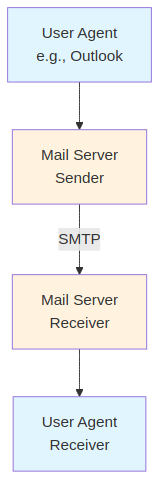
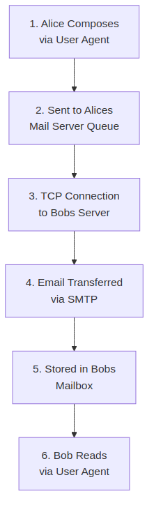
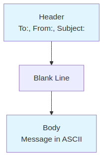

# Explanation of Pages 1-15: SMTP, POP3, IMAP, DNS, FTP, BitTorrent, Multimedia Streaming, DASH, CDN

Below is a detailed, easy-to-read explanation of the content from pages 1 to 15 of the PDF file 'CSE-801/Lecture-2-SMTP-POP3-IMAP-DNS-FTP-BitTorrent-Multimedia-Streaming-DASH-CDN.pdf'. I'll break it down section by section, explaining every technical term in simple language, incorporating Mermaid diagrams for better memorization, and describing any figures mentioned or implied in the content. The explanations are based solely on the provided text and focus on clarity, with diagrams used to visualize processes, hierarchies, and interactions. Technical terms are defined inline or in context to ensure nothing is left unexplained.

## 1. SMTP (Simple Mail Transfer Protocol)
- **Overview**: SMTP is a protocol (a set of rules for communication) used for sending emails over the internet. It's part of the application layer (the top layer of network communication that handles user-facing services like email). SMTP ensures emails are reliably transferred from one mail server to another.
- **Key Components**:
  - **Protocol**: A standardized way for devices to communicate, like a language for computers.
  - **Application Layer**: The layer in the network stack (a model of how data travels across networks) that deals with applications and services, such as web browsing or email.
- **Explanation of Figure**: The content describes a diagram showing the email system with user agents (email clients), mail servers, and SMTP connections. It illustrates how emails flow from sender to receiver via servers.
  - **Mermaid Diagram for Email Flow**:
    
    - **How to Read**: This flowchart shows the basic email path. User agents are like email apps (e.g., Gmail app). Mail servers store and forward emails. SMTP is the "highway" for email transfer between servers.

## 2. E-mail Components
- **Three Major Components**:
  - **User Agents**: Also known as "mail readers," these are software or apps for composing, editing, and reading emails (e.g., Outlook, iPhone Mail app). They interact with mail servers to send or receive messages.
  - **Mail Servers**: Computers that store incoming emails in a "mailbox" (a storage area for received emails) and hold outgoing emails in a "message queue" (a waiting area for emails to be sent).
  - **Simple Mail Transfer Protocol (SMTP)**: The protocol for transferring emails between mail servers, ensuring reliable delivery.
- **Explanation of Figure**: The diagram depicts multiple user agents connected to mail servers via SMTP, with visual elements like mailboxes and queues highlighted.
  - **Mermaid Diagram for Email Components**:
    
    - **How to Read**: Arrows show the flow. User agents send/receive emails, servers handle storage and transfer via SMTP.

## 3. E-mail: Mail Servers
- **Details**:
  - **Mailbox**: A folder or storage space on the mail server where incoming emails for a user are kept until retrieved.
  - **Message Queue**: A temporary storage area for outgoing emails waiting to be sent to other servers.
  - **SMTP Protocol**: Used between mail servers to send emails. The sending server acts as the "client" (initiator), and the receiving server as the "server" (responder).
- **Explanation of Figure**: Similar to the previous diagram, it shows mail servers with mailboxes and queues, emphasizing SMTP connections.
  - **Mermaid Diagram** (Enhanced for Mail Servers):
    
    - **How to Read**: Focuses on server roles. Queues and mailboxes are storage points, and SMTP is the transfer method.

## 4. SMTP RFC (5321)
- **Overview**: RFC 5321 is a standard document defining SMTP. It uses TCP (Transmission Control Protocol, a reliable connection-oriented protocol for data transfer) to send emails from a client (sending mail server) to a server (receiving mail server) on port 25 (a specific "door" for SMTP communication).
- **Phases of Transfer**:
  - **SMTP Handshaking (Greeting)**: Initial connection setup where servers exchange greetings.
  - **SMTP Transfer of Messages**: Actual email data is sent.
  - **SMTP Closure**: Connection is ended.
- **Command/Response Interaction**: Like HTTP (HyperText Transfer Protocol, used for web pages), it uses ASCII text commands (human-readable text) and responses with status codes (numbers indicating success or error, e.g., 220 for "ready").
- **Explanation of Figure**: The diagram shows a timeline of SMTP handshaking, including TCP connection initiation, greetings (e.g., HELO), and responses (e.g., 250 Hello).
  - **Mermaid Diagram for SMTP Handshaking**:
    
    - **How to Read**: Sequence diagram shows step-by-step interaction. TCP ensures reliability; port 25 is specific to SMTP.

## 5. Scenario: Alice Sends E-mail to Bob
- **Step-by-Step Process**:
  1. Alice uses her User Agent to compose the email.
  2. The User Agent sends the email to Alice's mail server via SMTP, placing it in the message queue.
  3. Alice's mail server (as SMTP client) opens a TCP connection to Bob's mail server.
  4. The email is transferred over the connection.
  5. Bob's mail server stores the email in Bob's mailbox.
  6. Bob uses his User Agent to read the email.
- **Explanation of Figure**: A numbered flowchart showing the email journey from Alice to Bob via servers.
  - **Mermaid Diagram**:
    
    - **How to Read**: Follow the numbers for the email's path.

## 6. SMTP: Observations
- **Key Points**:
  - **Persistent Connections**: SMTP keeps the TCP connection open for multiple emails, unlike one-time connections.
  - **7-bit ASCII**: Emails must use basic text characters (no special formats like images without encoding).
  - **CRLF.CRLF**: Carriage Return Line Feed (end-of-line markers) to signal message end.
  - **Comparison with HTTP**: HTTP is "pull" (client requests data), SMTP is "push" (client sends data). Both use ASCII and status codes, but HTTP sends one object per response, while SMTP can send multiple in one message.
- **No Specific Figure**: Explained via text comparison.

## 7. Mail Message Format
- **Overview**: Defined by RFC 5321 (SMTP protocol) and RFC 2822 (email syntax, like HTML for web pages).
- **Structure**:
  - **Header**: Lines like To, From, Subject (metadata about the email).
  - **Body**: The main message content, in ASCII only.
  - **Blank Line**: Separates header and body.
- **Explanation of Figure**: Diagram shows a box with header (top) and body (bottom), separated by a blank line.
  - **Mermaid Diagram**:
    
    - **How to Read**: Visualizes email structure.

## 8. Sample SMTP Interaction
- **Overview**: Example of commands like HELO, MAIL FROM, RCPT TO, DATA, and responses (e.g., 220, 250).
- **No Diagram Needed**: Text-based interaction log.

## 9. Retrieving Email: Mail Access Protocols
- **Overview**: SMTP delivers emails to the server; access protocols retrieve them.
  - **IMAP (Internet Mail Access Protocol)**: RFC 3501; stores messages on the server, allows retrieval, deletion, and folder management.
  - **HTTP**: Used by webmail (e.g., Gmail) on top of SMTP (send) and IMAP/POP (retrieve).
- **Explanation of Figure**: Diagram shows SMTP for delivery and access protocols (IMAP, HTTP) for retrieval.
  - **Mermaid Diagram**:
    

## 10. Threats to SMTP Security
- **Threats**: Unauthorized access, spam/phishing (deceptive emails), malware (harmful software), DoS attacks (overloading servers).
- **Solutions**: SSL/TLS (encryption for security), end-to-end encryption (protects data in transit), S/MIME (secure email standard), PGP (Pretty Good Privacy for encryption), Bitmessage (anonymous messaging).
- **No Diagram**: List-based.

## 11. FTP: The File Transfer Protocol
- **Overview**: Protocol for transferring files between a client and server. Uses TCP on port 21.
- **Explanation of Figure**: Shows user interface, FTP client, and server with local/remote file systems.
  - **Mermaid Diagram**:
    

## 12. FTP: Separate Control, Data Connections
- **Overview**: Control connection (port 21) for commands; data connection (port 20) for files. Server maintains state (tracks directory, authentication).
- **Explanation of Figure**: Diagrams for control and data connections.
  - **Mermaid Diagram**:
    

## 13. FTP: Control and Data Connections (Detailed)
- **Details**: Passive (server waits) vs. Active (client initiates) opens for connections.
- **Explanation of Figures**: Step-by-step diagrams for control and data setups.
  - **Mermaid Diagram**:
    

This covers pages 1-15 comprehensively. For memorization, review the diagrams sequentially to visualize processes. If you need expansions or clarifications, let me know!