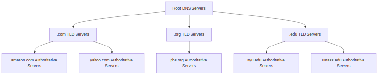
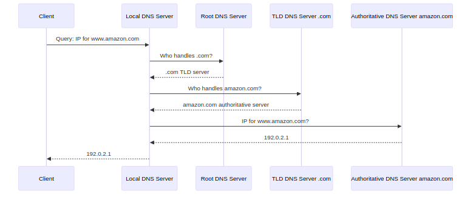

# Detailed Explanation of DNS (Domain Name System) from Pages 16-32

This explanation covers the DNS section from the PDF, focusing on pages 16-32. I'll break it down into clear sections, explain all technical terms in simple language, include Mermaid diagrams for better memorization, and describe any figures from the content. DNS is like a phonebook for the internet, translating human-friendly names (like www.google.com) into machine-readable IP addresses (like 216.58.204.68).

## 1. Introduction to DNS

DNS stands for **Domain Name System**. It's a system that maps human-readable domain names to IP addresses, which are numerical labels used by computers to identify devices on a network.

- **Why DNS?** People use names like "google.com" for websites, but computers communicate using IP addresses (e.g., 32-bit numbers like 192.168.1.1). DNS acts as a translator to bridge this gap.
- **Key Components:**
  - **IP Address:** A unique numerical identifier for a device on the internet (e.g., 192.168.1.1). It's like a street address for your computer.
  - **Hostname:** A human-friendly name for a device (e.g., www.example.com). This is what you type in your browser.
- **Why not centralize DNS?** A single central database would fail under high traffic, have a single point of failure, and be hard to maintain globally. Instead, DNS is distributed across many servers worldwide.

Figure Description: The introductory slide (2-16) shows a simple diagram with people using identifiers (like names) and internet devices using IP addresses, highlighting the need for DNS to map between them.

## 2. DNS Services and Structure

DNS provides several services and is structured as a distributed, hierarchical database.

- **Services Offered:**
  - **Hostname-to-IP Translation:** Converts names like "www.amazon.com" to IP addresses.
  - **Host Aliasing:** Allows multiple names for the same IP (e.g., "example.com" and "www.example.com").
  - **Mail Server Aliasing:** Maps domain names to email servers.
  - **Load Distribution:** Spreads traffic across multiple servers for the same name.
- **Structure:** DNS is a distributed database with millions of servers. It handles trillions of queries daily, mostly reads (lookups) rather than writes (updates). It's decentralized, with organizations managing their own records, and it's designed for reliability and security.

Figure Description: Slide 2-17 illustrates people and internet identifiers, with DNS as a distributed database. Slide 2-18 discusses why DNS isn't centralized, showing stats like Comcast handling 1.0T queries/day and Akamai 7.0T, emphasizing scalability.

Mermaid Diagram: DNS Hierarchy

## 3. DNS Hierarchy

DNS is organized in a tree-like hierarchy for efficient lookups.

- **Root DNS Servers:** The top level, managed by ICANN (Internet Corporation for Assigned Names and Numbers). There are 13 logical root servers, replicated hundreds of times worldwide. They direct queries to the appropriate Top-Level Domain (TLD) servers.
- **TLD Servers:** Handle domains like .com, .org, .net. Examples: Network Solutions for .com, Educause for .edu.
- **Authoritative DNS Servers:** The final servers for a specific domain, providing the exact IP address. Maintained by the organization or their provider.
- **Local DNS Servers:** Your ISP's server. It caches recent lookups and forwards queries if needed.

Figure Description: Slide 2-20 shows a tree diagram of the DNS hierarchy, starting from the root, branching to TLDs like .com, and then to authoritative servers for specific domains like amazon.com.

Mermaid Diagram: Example Query Flow

## 4. DNS Name Resolution Processes

There are two main ways to resolve names: iterative and recursive queries.

- **Iterative Query:** The contacted server replies with the next server to ask, not the full answer. It's like getting directions step-by-step.
- **Recursive Query:** The contacted server handles the entire resolution and returns the final answer. This puts more load on upper-level servers.
- **Caching:** Servers store recent mappings temporarily (with a Time To Live or TTL) to speed up responses. Cached data may become outdated if IPs change.

Figure Description: Slide 2-25 shows an iterative query diagram with a client querying local DNS, which then queries root, TLD, and authoritative servers step-by-step. Slide 2-26 shows recursive query where the local DNS handles all steps.

Mermaid Diagram: Iterative vs Recursive

## 5. DNS Records and Protocol

DNS stores records in a specific format, and messages follow a standard structure.

- **DNS Records (RR - Resource Records):** Format: (name, value, type, ttl)
  - **Type A:** Maps hostname to IP address (e.g., www.example.com -> 192.168.1.1).
  - **Type NS:** Points to the authoritative name server for a domain.
  - **Type CNAME:** Alias for another name (e.g., www.ibm.com is an alias for servereast.backup2.ibm.com).
  - **Type MX:** Specifies the mail server for a domain.
- **Protocol Messages:** Both queries and replies use the same format, including a header with identification, flags (e.g., query/reply, recursion desired), and sections for questions, answers, authority, and additional info.

Figure Description: Slide 2-28 lists DNS records with examples. Slide 2-29 and 2-30 show the DNS message header as a table with fields like identification (16-bit number for matching queries/replies), flags (indicating query/reply, recursion), and sections for questions, answers, etc.

Mermaid Diagram: DNS Message Format

## 6. Getting Info into DNS and Security

To add a domain, register with a registrar and set up servers. Security is crucial due to threats.

- **Registering a Domain:** Contact a registrar (e.g., Network Solutions), provide authoritative server details, and they update TLD servers with NS and A records.
- **Security Threats:**
  - **DDoS Attacks:** Overwhelm servers with traffic (e.g., root servers are protected by filtering).
  - **Spoofing/Cache Poisoning:** Fake replies to mislead caches.
  - **DNSSEC:** Provides authentication and integrity to prevent spoofing.

Figure Description: Slide 2-21 shows a world map with root server locations (e.g., many in the US). Slide 2-31 explains registering a domain with examples of NS and A records.

This covers the DNS section in detail. All terms are explained, diagrams help visualize, and figures are described for clarity. If you need more on other sections, let me know!
