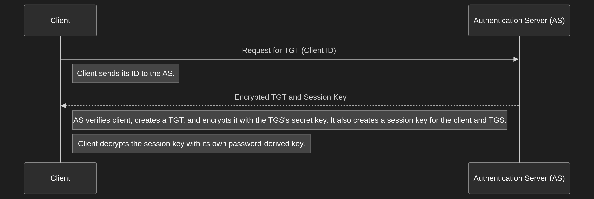

# Kerberos Authentication Protocol Explained

Kerberos is a network authentication protocol designed to provide strong authentication for client/server applications by using secret-key cryptography. It uses a trusted third party, known as the Key Distribution Center (KDC), to authenticate clients to servers and vice versa.

## Core Components

Before diving into the process, let's understand the key components involved:

- **Client (C)**: The user or machine that wants to access a service.
- **Service Server (SS)**: The server that provides the requested service (e.g., a file server or a database).
- **Key Distribution Center (KDC)**: The trusted third party that handles authentication. The KDC is composed of two logical parts:
  - **Authentication Server (AS)**: Authenticates the client and issues a Ticket-Granting Ticket (TGT).
  - **Ticket-Granting Service (TGS)**: Issues service tickets to clients after they present a valid TGT.
- **Tickets**: Encrypted data packets that prove the identity of a user. There are two main types:
  - **Ticket-Granting Ticket (TGT)**: A ticket that allows the client to obtain service tickets from the TGS.
  - **Service Ticket (ST)**: A ticket that allows the client to access a specific service.

## The Kerberos Authentication Flow

The process can be broken down into three main exchanges:

### 1. Authentication Service (AS) Exchange: The Client gets a TGT

The first step is for the client to prove its identity to the KDC's Authentication Server (AS) to get a Ticket-Granting Ticket (TGT).

- **Client to AS**: The client sends its ID to the AS, requesting a TGT.
- **AS to Client**:
  1. The AS checks if the client exists in its database.
  2. It generates a **TGT**, which contains the client's ID, a timestamp, and a session key (`SessionKey_C_TGS`). The TGT is encrypted with the TGS's secret key, so the client cannot read it.
  3. The AS also sends the same session key (`SessionKey_C_TGS`) to the client, but this time it's encrypted with the client's own secret key (derived from the user's password).
  4. The client receives this message and uses its password to decrypt its portion, successfully obtaining the `SessionKey_C_TGS`. The client now has the TGT and a session key to communicate securely with the TGS.

### 2. Ticket-Granting Service (TGS) Exchange: The Client gets a Service Ticket

Now that the client has a TGT, it can request a Service Ticket (ST) for a specific service from the Ticket-Granting Service (TGS).

- **Client to TGS**: The client sends three things to the TGS:
  1. The **TGT** it received from the AS.
  2. An **Authenticator**, which is a message containing the client's ID and a timestamp, encrypted with the `SessionKey_C_TGS`. This proves the client is who it claims to be.
  3. The **ID** of the service it wants to access.
- **TGS to Client**:
  1. The TGS decrypts the TGT with its own secret key and decrypts the Authenticator with the `SessionKey_C_TGS`.
  2. It verifies that the client information from the TGT and the Authenticator match.
  3. It generates a **Service Ticket (ST)**, which contains the client's ID and a new session key (`SessionKey_C_SS`) for the client and the service server. The ST is encrypted with the service server's secret key.
  4. The TGS sends the ST and the `SessionKey_C_SS` to the client. The `SessionKey_C_SS` is encrypted with the `SessionKey_C_TGS`.

### 3. Client/Server (CS) Exchange: The Client Accesses the Service

The client now has a Service Ticket and can finally present it to the Service Server (SS) to gain access.

- **Client to SS**: The client sends two things to the service server:
  1. The **Service Ticket (ST)**.
  2. A new **Authenticator**, encrypted with the `SessionKey_C_SS`.
- **SS to Client**:
  1. The service server decrypts the ST with its own secret key to retrieve the `SessionKey_C_SS`.
  2. It then uses this session key to decrypt the Authenticator and verifies the client's identity and the timestamp.
  3. If everything checks out, the server trusts the client and grants access to the service.
  4. **Mutual Authentication (Optional)**: The server can send a message back to the client, encrypted with the `SessionKey_C_SS`, to prove its own identity. This confirms for the client that it is communicating with the legitimate server.

## Summary Diagram

This diagram shows the complete flow, from the initial request to the final service access.

By using this system of tickets and trusted third parties, Kerberos ensures that passwords are never sent over the network, and both the client and server can be confident in each other's identity.
