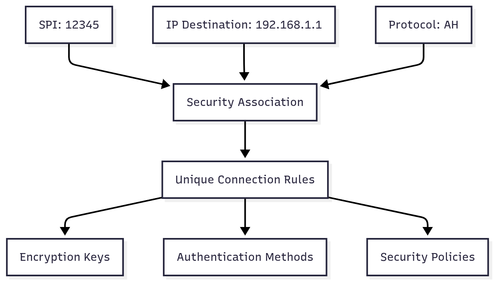
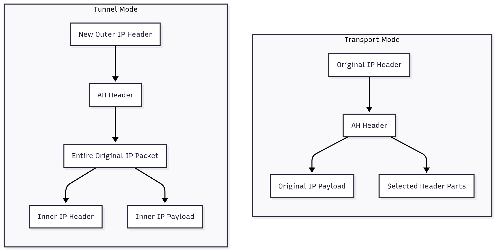
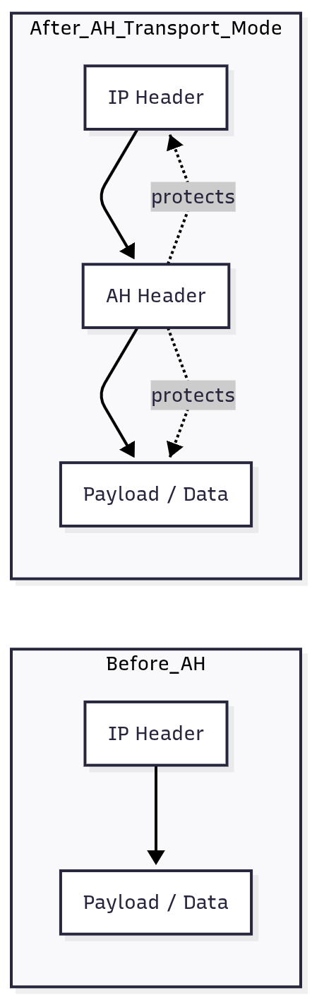
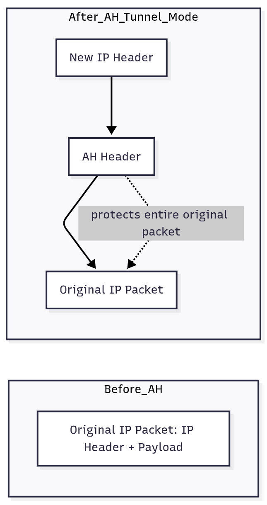
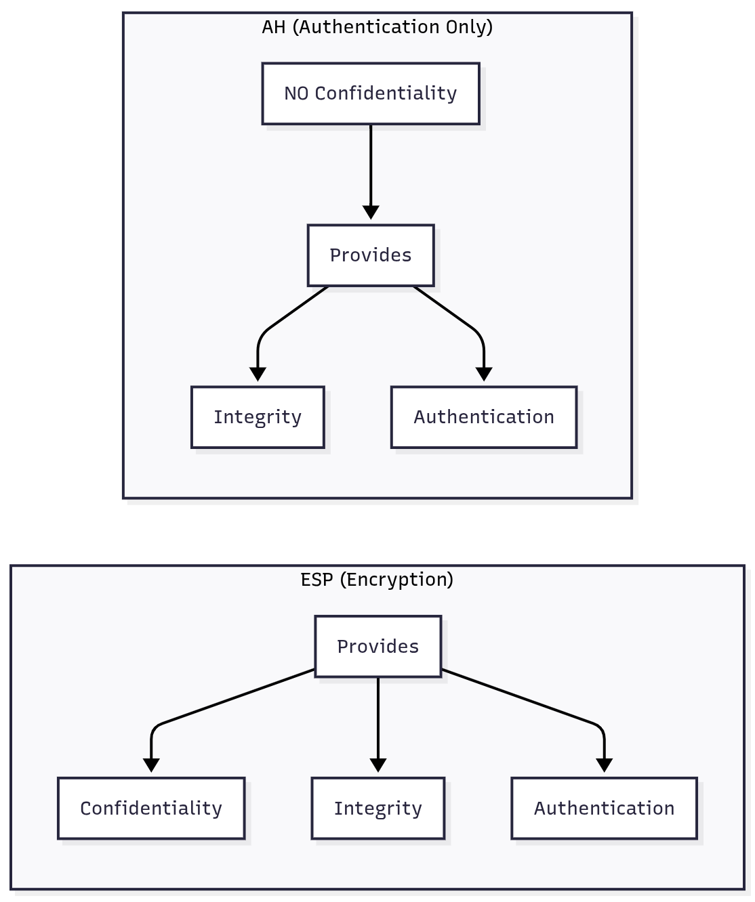

# IPsec (IP Security) - Easy Explanation

## What is IPsec?
IPsec is a set of rules and tools that make internet communication secure. It protects data as it travels from one computer to another over the internet. Think of it like a secure envelope for your digital letters.

## Key Concepts Explained

### 1. Security Parameter Index (SPI)
The SPI is like a unique identification number for a secure connection. Imagine you have multiple secret conversations with different people - each conversation has its own number so you know which rules to follow for that specific talk.

**Simple analogy:** It's like a locker combination. Each locker (secure connection) has a unique number that only the right people know.

### 2. IP Destination Address
This is the IP address of where the data is being sent. An IP address is like a home address on the internet - it tells the data exactly where to go.

**Simple explanation:** Just like mailing a letter, you need the recipient's address. In IPsec, this address helps identify which security setup to use.

### 3. Security Protocol Identifier
This tells the system whether to use ESP or AH:
- **ESP (Encapsulating Security Payload):** Like putting your letter in a locked box (encryption)
- **AH (Authentication Header):** Like signing your letter to prove it's really from you (authentication)

**Simple analogy:** ESP hides what's inside the box, AH just proves who sent it.

### 4. How SPI + IP Destination Address Work Together
These two things combined create a unique "fingerprint" for each secure connection. It's like using both a person's name AND their phone number to identify them - together they're unique.

**Why this matters:** The internet has billions of connections. This system ensures each secure connection is completely separate and can't be confused with others.

### 5. Authentication Header (AH)
AH is a security feature that:
- **Provides integrity:** Makes sure the data wasn't changed during travel
- **Provides authentication:** Proves who really sent the message
- **Does NOT provide confidentiality:** Anyone can still read the message content

**Simple analogy:** It's like a wax seal on a letter. The seal proves the letter is genuine and hasn't been tampered with, but you can still read what's inside.

### 6. Transport Mode (for AH)
In transport mode, AH protects:
- The entire IP payload (the actual data being sent)
- Selected parts of the IP header (like the source and destination addresses)

**Simple explanation:** This is used when two computers want to talk securely directly to each other. It's like encrypting a phone call between two people.

**Use case:** End-to-end security between applications on different computers.

### 7. Tunnel Mode (for AH)
In tunnel mode, AH protects:
- The entire inner IP packet (the complete original message)
- Other portions of the outer header

**Simple explanation:** This creates a secure "tunnel" through the internet. Your data is wrapped in a new secure packet that travels through the tunnel.

**Use case:** VPNs (Virtual Private Networks) - like having a private road through public highways.

## Visual Diagrams

### Security Association Identification

### AH Transport Mode vs Tunnel Mode

### How AH Works in Transport Mode

### How AH Works in Tunnel Mode

### ESP vs AH Comparison

## Summary
IPsec uses Security Associations identified by SPI and destination IP to create secure connections. AH provides authentication and integrity checking (but not encryption), and can work in Transport Mode (direct computer-to-computer) or Tunnel Mode (VPN-style secure tunnels). ESP provides full encryption when confidentiality is also needed.

This system ensures your internet communications are secure, authentic, and tamper-proof!