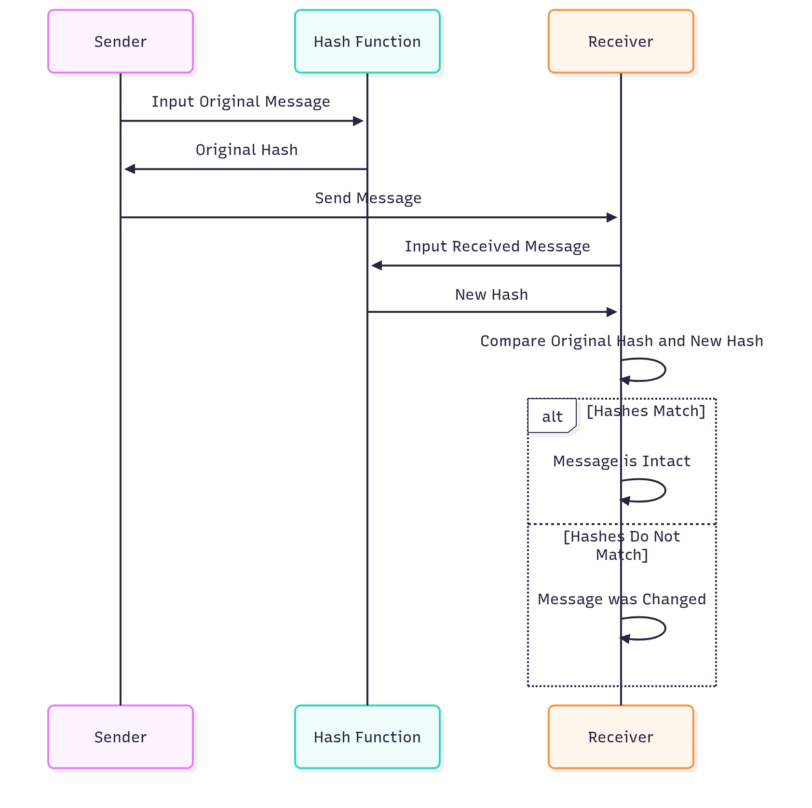
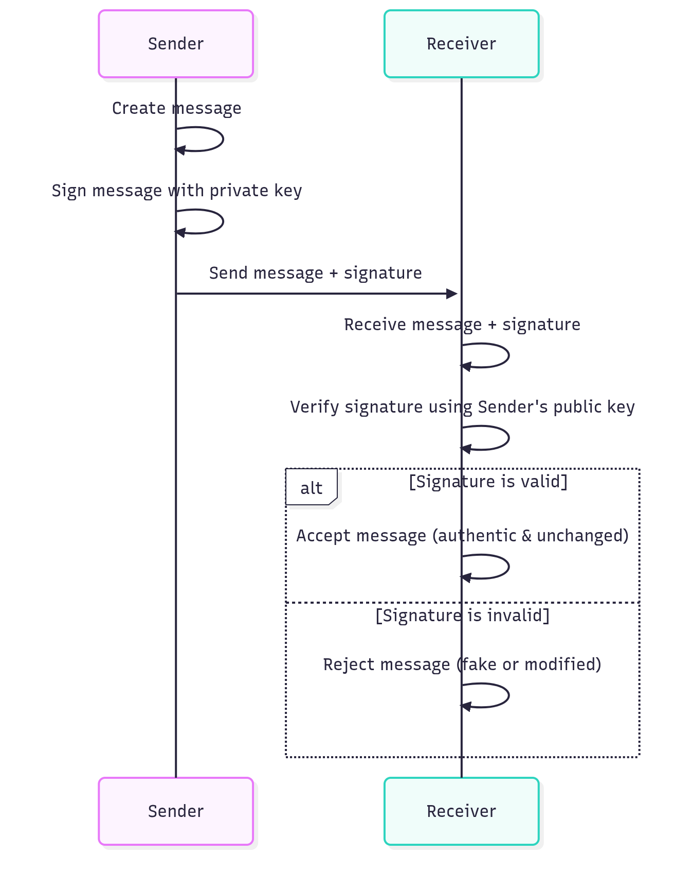

# Message Integrity and Digital Signatures: Explained Simply

## What is Message Integrity?

Sometimes, we don't need to keep a message secret (like hiding it from others), but we do need to make sure it hasn't been changed or tampered with. This is called **message integrity**. It's like making sure a letter you send arrives exactly as you wrote it, without anyone adding, removing, or changing words.

### How Does It Work? (Using a Hash Function)

Think of a **fingerprint** for documents. In the real world, fingerprints are unique to each person and help identify them. For digital messages, we use something similar called a **digest** or **hash**.

- A **cryptographic hash function** is like a special machine that takes your message (no matter how long) and squishes it down into a short, unique code called a **hash** or **digest**. This hash acts like a fingerprint for the message.
- The hash is always the same length (like 256 characters) and unique - even a tiny change in the message creates a completely different hash.
- To check if the message is unchanged:
  1. Run the same hash function on the received message.
  2. Compare the new hash with the original hash.
  3. If they match, the message is intact. If not, it was changed.

### Diagram: How Hash Functions Work

**Explanation of the diagram:**
- The sender creates a hash from the original message.
- The receiver creates a hash from the received message.
- If both hashes are identical, the message hasn't been altered.

## What is a Digital Signature?

A **digital signature** is like an electronic version of your handwritten signature on a document. It proves that you are the one who created or approved the message, and it also ensures the message hasn't been changed.

- It's used when you need to prove who sent something (authenticity) and that it wasn't modified (integrity).
- Unlike a regular signature, it uses math and special keys to work.

### How Does It Work? (Using Private and Public Keys)

Digital signatures use a pair of **keys**:
- **Private key**: A secret code only you have. It's like your personal password.
- **Public key**: A code everyone can see. It's shared openly, like your email address.

- **Signing (by the sender)**:
  1. The sender uses their private key with a signing algorithm (a set of math rules) to create a signature from the message.
  2. The signature is attached to the message and sent.

- **Verification (by the receiver)**:
  1. The receiver uses the sender's public key with a verification algorithm to check the signature.
  2. If the signature is valid, it proves the message came from the sender and wasn't changed.

### Diagram: How Digital Signatures Work

**Explanation of the diagram:**
- The sender signs the message with their private key.
- The receiver verifies using the sender's public key.
- Only the correct public key can verify a signature made with the matching private key.

## Key Differences

- **Message Integrity (Hash)**: Only checks if the message is unchanged. Doesn't prove who sent it.
- **Digital Signature**: Checks both integrity (unchanged) and authenticity (who sent it).

## Why This Matters

These tools help keep digital communication trustworthy. Without them, anyone could change emails, contracts, or files without you knowing. They're used in banking, email, software downloads, and more to ensure security.

**Remember**: Always use strong, well-known hash functions and keep your private keys secret!