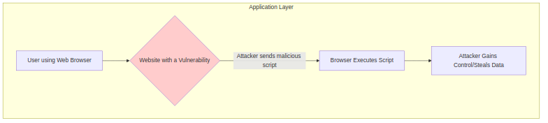
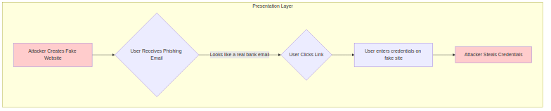
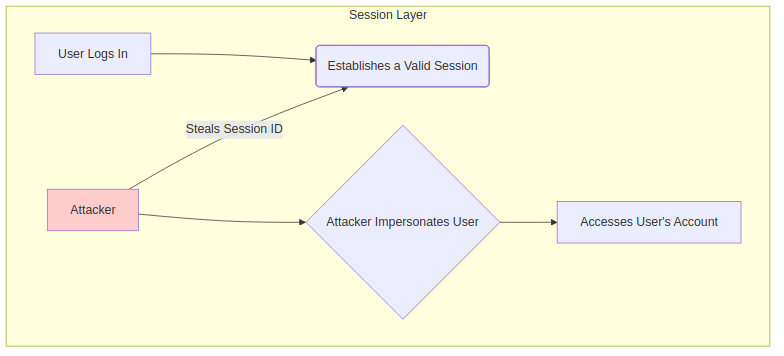
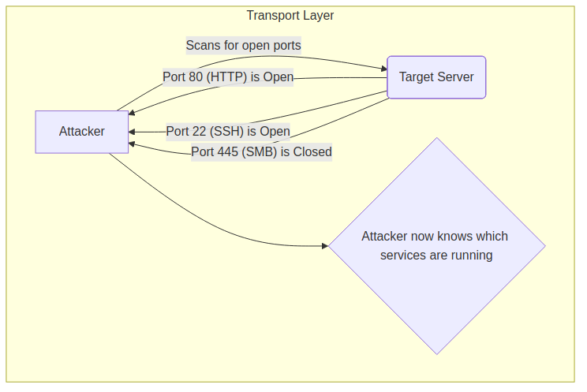
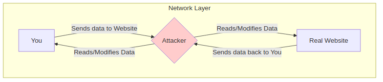
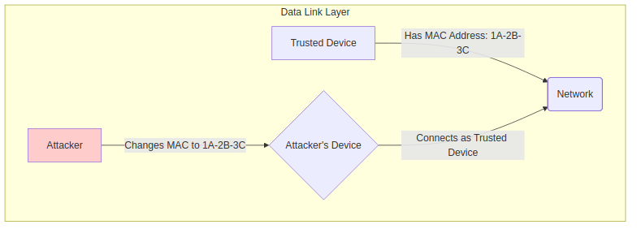
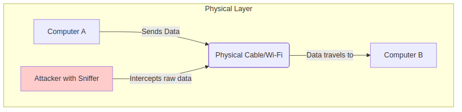

# Cyber Attacks on OSI Layers

This document explains common cyber attacks that target each layer of the OSI model, based on the provided diagram.

## Layer 7: Application Layer Attack - Exploit

-   **Simple Explanation:** At this layer, an "exploit" takes advantage of a weakness or bug in a software application (like a web browser, email client, or server software) to make it do something it wasn't designed to do. This could be to steal data, crash the application, or gain control over the computer.
-   **Example:** A specially crafted link or file is sent to you. When you open it, it triggers a bug in your PDF reader that allows the attacker to run malicious code on your system.

## Layer 6: Presentation Layer Attack - Phishing

-   **Simple Explanation:** Phishing is a trick to make you give away your personal information, like passwords or credit card numbers. The attacker creates a fake website or email that looks exactly like a real one (e.g., your bank's website). The Presentation Layer is targeted because it's responsible for how data is presented. Phishing manipulates what the user sees to deceive them.
-   **Example:** You receive an email that looks like it's from your bank, asking you to "verify your account" by clicking a link. The link takes you to a fake website that looks identical to the real one. When you enter your username and password, the attacker steals it.

## Layer 5: Session Layer Attack - Hijacking

-   **Simple Explanation:** Session Hijacking is like taking over someone's active conversation. When you log into a website, you create a "session." An attacker can steal your unique session ID and use it to impersonate you on that website, without needing your password.
-   **Example:** You are logged into your social media account. An attacker on the same Wi-Fi network intercepts your session cookie and uses it in their own browser. The website now thinks the attacker is you, giving them full access to your account.

## Layer 4: Transport Layer Attack - Reconnaissance

-   **Simple Explanation:** Reconnaissance is like a burglar scouting a neighborhood before a robbery. At the Transport Layer, attackers use techniques like "port scanning" to see which "doors" (ports) are open on a computer. This helps them find out what services are running (like a web server on port 80 or a database) and identify potential weaknesses.
-   **Example:** An attacker uses a tool like Nmap to scan your computer's IP address. The tool sends connection requests to thousands of ports. If port 3306 is open, the attacker knows you are likely running a MySQL database and can try to attack it.

## Layer 3: Network Layer Attack - Man-in-the-Middle (MITM)

-   **Simple Explanation:** A Man-in-the-Middle (MITM) attack is when an attacker secretly places themselves between you and the service you are trying to connect to (like a website). They can then read, modify, or inject messages into your communication. This happens at the Network Layer, which is responsible for routing traffic.
-   **Example:** You connect to a fake public Wi-Fi hotspot set up by an attacker. All your internet traffic now goes through the attacker's computer. They can see all the data you send and receive, including passwords and private messages.

## Layer 2: Data Link Layer Attack - Spoofing

-   **Simple Explanation:** Spoofing means pretending to be someone or something you're not. At the Data Link Layer, this often involves "MAC address spoofing." Every device has a unique hardware address (MAC address). An attacker can change their device's MAC address to match that of a trusted device on the network, allowing them to bypass security filters or intercept data meant for the trusted device.
-   **Example:** A network is configured to only allow devices with specific MAC addresses to connect. An attacker finds out a trusted MAC address, changes their own device's MAC to match it, and successfully connects to the secure network.

## Layer 1: Physical Layer Attack - Sniffing

-   **Simple Explanation:** Sniffing is like wiretapping a phone line. At the Physical Layer, an attacker can directly tap into the network cable (e.g., Ethernet) or intercept wireless signals (Wi-Fi) to capture all the raw data (bits) flowing through the network. This data can then be analyzed to find sensitive information.
-   **Example:** An attacker plugs a special device into the physical Ethernet cable in an office. This device copies all the data packets traveling on that cable, allowing the attacker to later analyze them for usernames, passwords, and other confidential information.

