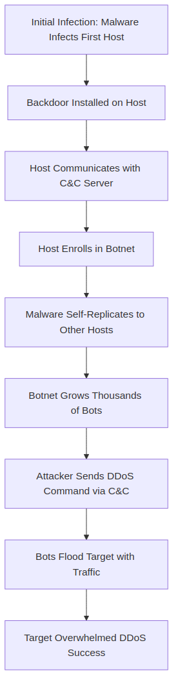

# Section 1.6 Review Questions Answers

Based on the context from Section 1.6 "Networks Under Attack" of "Computer Networking: A Top-Down Approach" by Kurose and Ross, here are the answers to the review questions R26 through R28. Each answer is explained clearly, with relevant examples, theory, and Mermaid diagrams where they enhance visualization and understanding. These are designed for exam preparation, highlighting key concepts from network security threats.

## R26. What is self-replicating malware?

### Explanation
Self-replicating malware, also known as worms or viruses, is malicious software that automatically spreads from an infected host to other hosts over the Internet without user intervention. Once a host is infected, the malware seeks entry into additional hosts, often exploiting vulnerabilities in software or operating systems. This exponential spread can infect thousands of devices rapidly, creating a network of compromised hosts.

### Key Characteristics
- **Exponential Growth**: Each infected host becomes a source for infecting others, leading to rapid proliferation (e.g., from 1 to 2, 4, 8 hosts in successive rounds).
- **No User Action Required**: Unlike viruses that need user actions like opening attachments, worms can spread autonomously.
- **Impact**: Infected hosts may delete files, steal data, or enroll in botnets for further attacks like DDoS or spam distribution.

### Example
The Morris Worm (1988) was an early self-replicating malware that infected thousands of Unix systems by exploiting buffer overflows and password weaknesses, demonstrating how quickly such malware can overwhelm networks.

## R27. Describe how a botnet can be created and how it can be used for a DDoS attack.

### Explanation
A botnet is a network of compromised hosts (bots or zombies) controlled by an attacker. It is created through malware infection and used for large-scale attacks like Distributed Denial-of-Service (DDoS).

### How a Botnet Is Created
1. **Initial Infection**: Malware (often self-replicating) infects a host via email attachments, malicious websites, or software vulnerabilities.
2. **Enrollment**: The malware installs a backdoor, allowing the attacker to control the host remotely. The infected host communicates with a command-and-control (C&C) server to join the botnet.
3. **Spread**: The malware self-replicates, infecting more hosts and expanding the botnet. Attackers use techniques like phishing or drive-by downloads to accelerate growth.
4. **Control**: The attacker sends commands to all bots via the C&C server, coordinating actions.

### How It Is Used for a DDoS Attack
In a DDoS attack, the botnet floods a target (e.g., a web server) with traffic, overwhelming its resources and making it unavailable to legitimate users.

1. **Bandwidth Flooding**: Bots send massive packets (e.g., SYN floods or UDP floods) to clog the target's access link.
2. **Connection Flooding**: Bots establish bogus TCP connections, exhausting server resources.
3. **Distributed Nature**: Unlike a single-host DoS, DDoS uses thousands of bots, making it harder to block (traffic comes from diverse IPs).

### Example
The Mirai botnet (2016) infected IoT devices and launched DDoS attacks reaching 1 Tbps, taking down sites like Twitter and Netflix.

## R28. Suppose Alice and Bob are sending packets to each other over a computer network. Suppose Trudy positions herself in the network so that she can capture all the packets sent by Alice and send whatever she wants to Bob; she can also capture all the packets sent by Bob and send whatever she wants to Alice. List some of the malicious things Trudy can do from this position.

### Explanation
This scenario describes a Man-in-the-Middle (MITM) attack, where Trudy intercepts and controls communication between Alice and Bob. Trudy can eavesdrop, modify, or disrupt packets, violating confidentiality, integrity, and availability.

### Malicious Actions Trudy Can Perform
1. **Eavesdropping (Passive Attack)**: Capture and read packet contents, such as passwords, messages, or sensitive data (e.g., credit card numbers). This violates confidentiality.
2. **Message Modification**: Alter packet payloads (e.g., change a bank transfer amount from $100 to $1000) or headers, leading to incorrect actions. This violates integrity.
3. **Impersonation**: Send fake packets pretending to be Alice or Bob (e.g., forge responses to trick Bob into revealing secrets). This exploits trust.
4. **Packet Dropping**: Discard packets to disrupt communication (e.g., prevent Alice's message from reaching Bob), causing denial-of-service.
5. **Replay Attacks**: Resend captured packets (e.g., replay a login request to gain unauthorized access).
6. **Session Hijacking**: Steal session identifiers (e.g., cookies) to take over an active session, as in web logins.
7. **Injection Attacks**: Insert malicious packets (e.g., inject SQL commands if packets contain database queries).

### Example
In an e-commerce transaction, Trudy could intercept Alice's order packet, modify the shipping address to her own, and forward it to Bob (the merchant), stealing the goods.

