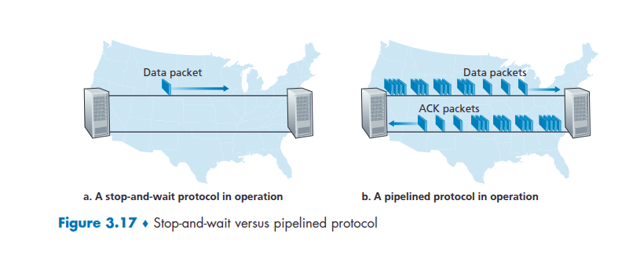

# Networking Problems and Solutions

## Table of Contents

- P12. rdt3.0 Ignoring vs. Retransmitting on Bad ACK
- P13. Message Reordering in rdt3.0
- P14. ACK vs NAK Protocols
- P15. Channel Utilization and Window Size
- P16. TCP Flow Control Effect

## P12. rdt3.0 Ignoring vs. Retransmitting on Bad ACK

The sender side of **rdt3.0** simply ignores (takes no action on) all received packets that are either in error or have the wrong value in the *acknum* field. Suppose that in such circumstances, **rdt3.0** were simply to retransmit the current data packet. Would the protocol still work?

*Hint:* Consider what would happen if there were only bit errors; there are no packet losses but premature timeouts can occur. Consider how many times the nth packet is sent, in the limit as n approaches infinity.

---

### Solution

**No, the protocol would not work correctly.** This modification introduces a serious flaw that can lead to a cascade of unnecessary retransmissions and potential deadlock or livelock scenarios.

#### The Problem: A Vicious Cycle of Retransmissions

Let's trace the scenario suggested by the hint: no packet loss, but ACKs can be delayed, causing premature timeouts.

**Normal `rdt3.0` Operation (for comparison):**

1.  Sender sends `pkt(n)`.
2.  `ACK(n)` is sent by the receiver but is delayed.
3.  Sender **times out** and retransmits `pkt(n)`.
4.  Receiver gets duplicate `pkt(n)` and re-sends `ACK(n)`.
5.  Sender receives the first (delayed) `ACK(n)`. It stops its timer and sends `pkt(n+1)`.
6.  Sender then receives the second `ACK(n)`. It **ignores** this ACK because it is now waiting for `ACK(n+1)`. This is the crucial step.

**Modified Protocol Operation (Retransmit on wrong ACK):**

1.  Sender sends `pkt(n)`.
2.  `ACK(n)` is sent by the receiver but is delayed.
3.  Sender **times out** and retransmits `pkt(n)`.
4.  Receiver gets duplicate `pkt(n)` and re-sends `ACK(n)`.
5.  Sender receives the first (delayed) `ACK(n)`. It stops its timer, sends `pkt(n+1)`, and starts waiting for `ACK(n+1)`.
6.  Sender now receives the second `ACK(n)` (from step 4).
7.  Under the **modified protocol**, receiving `ACK(n)` while waiting for `ACK(n+1)` is an "error" condition. Instead of ignoring it, the sender immediately **retransmits the current packet, `pkt(n+1)`**.
8.  The receiver gets this unnecessary retransmission of `pkt(n+1)`. It acknowledges it with `ACK(n+1)`.
9.  Now, the original `ACK(n+1)` from the first `pkt(n+1)` might arrive at the sender. This would be a duplicate `ACK`, triggering yet another retransmission.

#### Why this is a disaster:

This creates a feedback loop. A single delayed ACK can trigger a retransmission, which can lead to more duplicate ACKs arriving at the sender at the wrong time, each of which triggers another unnecessary retransmission.

The channel becomes filled with duplicate data packets and duplicate ACKs. The sender is constantly retransmitting packets not because they were lost, but because it's reacting incorrectly to delayed, out-of-order acknowledgments.

**In the limit as n approaches infinity:**

The number of times the nth packet is sent would not converge. Each packet transmission has a chance of creating a delayed ACK that will trigger a spurious retransmission of the *next* packet. This effect cascades. The number of transmissions for each packet would likely grow, leading to extremely low channel utilization and possibly a state of livelock, where the sender and receiver are constantly exchanging useless duplicate packets. The protocol's performance would degrade catastrophically.

Therefore, ignoring unexpected ACKs is essential for the stability of the protocol.

## P13. Message Reordering in rdt3.0

Draw a diagram showing that if the network connection between the sender and receiver can reorder messages, then the **alternating-bit protocol** will not work correctly. Make sure you clearly identify the sense in which it will not work correctly.

---

### Solution

The alternating-bit protocol (`rdt3.0`) relies on the assumption that while packets can be lost or delayed, their relative order is maintained. If the network can reorder packets, the protocol can fail by delivering duplicate data to the application layer or getting stuck.

#### The Failure Scenario: Reordered ACKs

The most common failure happens when an old, heavily delayed ACK is reordered and arrives after a new packet has already been sent and acknowledged.

**Sense of Failure:** The receiver will accept a duplicate packet as new data, leading to **duplicate data being delivered to the application layer**.

#### Timeline Diagram

```
      SENDER                                     RECEIVER
      ------                                     --------

      [State: Wait for call 0]
      sends pkt0
         -------------------- pkt0 ------------------->
                                                   [State: Wait for 0]
                                                   rcv pkt0, deliver data
                                                   sends ACK0
         <-------------------- ACK0 -------------------

      rcv ACK0, sends pkt1
         -------------------- pkt1 ------------------->
                                                   [State: Wait for 1]
                                                   rcv pkt1, deliver data
                                                   sends ACK1
         <------------ (very delayed) ACK1 ----------- (1)
      rcv ACK1, sends pkt0 (new data)
         -------------------- pkt0 ------------------->
                                                   [State: Wait for 0]
                                                   rcv pkt0, deliver data
                                                   sends ACK0
         <------------ (very delayed) ACK0 ----------- (2)

      // Sender receives the delayed ACK0 from step (2).
      // It assumes this is the ACK for the *new* pkt0 it just sent.
      rcv ACK0, sends pkt1 (new data)
         -------------------- pkt1 ------------------->
                                                   [State: Wait for 1]
                                                   rcv pkt1, deliver data
                                                   sends ACK1
         <-------------------- ACK1 -------------------

      rcv ACK1. Everything seems normal so far.
      [State: Wait for call 0]
      sends pkt0 (new data)
         -------------------- pkt0 ------------------->
                                                   [State: Wait for 0]
                                                   rcv pkt0, deliver data
                                                   sends ACK0
         <-------------------- ACK0 -------------------

      // NOW THE REORDERING HAPPENS
      // The very old, delayed ACK1 from step (1) finally arrives.
      // The sender is currently waiting for ACK0.
      rcv ACK1 (old, reordered)

      // Sender ignores the out-of-sequence ACK1 and waits.
      // Its timer for the current pkt0 is still running.

      ...timeout!
      // Sender never got the real ACK0 for the current pkt0.
      // It times out and retransmits pkt0.
      retransmits pkt0
         -------------------- pkt0 ------------------->
                                                   [State: Wait for 1]
                                                   // Receiver is waiting for pkt1,
                                                   // but it receives pkt0.
                                                   rcv pkt0 (duplicate)
                                                   // It discards the data but
                                                   // re-sends the last ACK it sent.
                                                   sends ACK1
         <-------------------- ACK1 -------------------

      // Sender is waiting for ACK0, but it receives ACK1.
      // It ignores it and waits.
      rcv ACK1

      ...timeout!
      // Sender is stuck in a loop, retransmitting pkt0 and
      // receiving ACK1 in response, which it ignores.
      // DEADLOCK.
```

**A simpler failure case leading to duplicate data:**

```
      SENDER                                     RECEIVER
1.    sends pkt0
         -------------------- pkt0 ------------------->
                                                   rcv pkt0, deliver data
                                                   sends ACK0
         <------------ (very delayed) ACK0 -----------

2.    ...timeout! (Sender thinks pkt0 or ACK0 was lost)
      retransmits pkt0
         -------------------- pkt0 ------------------->
                                                   rcv duplicate pkt0, discards
                                                   resends ACK0
         <-------------------- ACK0 -------------------

3.    rcv ACK0, sends pkt1
         -------------------- pkt1 ------------------->
                                                   rcv pkt1, deliver data
                                                   sends ACK1
         <-------------------- ACK1 -------------------

4.    rcv ACK1, sends pkt0 (with NEW data)
         -------------------- pkt0 ------------------->
                                                   rcv pkt0, deliver data
                                                   sends ACK0
         <-------------------- ACK0 -------------------

5.    // NOW, the very delayed ACK0 from step 1 finally arrives.
      // The network has reordered it to appear after the ACK0 from step 4.
      rcv ACK0 (old, reordered)

      // The sender thinks this is the ACK for the pkt0 it just sent.
      // It moves on, thinking the transaction is complete.
      // BUT, the ACK from step 4 is still in flight.

6.    sends pkt1 (with NEW data)
         -------------------- pkt1 ------------------->
                                                   rcv pkt1, deliver data
                                                   sends ACK1
         <-------------------- ACK1 -------------------

7.    // Now the ACK0 from step 4 arrives.
      rcv ACK0 (duplicate)
      // Sender is waiting for ACK1, so it ignores this.

      // Let's assume the ACK1 from step 6 is lost.
      ...timeout!
      retransmits pkt1
         -------------------- pkt1 ------------------->
                                                   // Receiver is now waiting for pkt0,
                                                   // but it receives pkt1.
                                                   rcv pkt1 (duplicate)
                                                   // It thinks this is a retransmission
                                                   // and re-sends ACK1.
         <-------------------- ACK1 -------------------

      // This seems to work, but the problem is that the 1-bit sequence
      // number is not enough to distinguish between a new packet and a
      // retransmission when ACKs can be arbitrarily reordered.
      // The fundamental issue is that an ACK for a previous "incarnation"
      // of pkt0 can be mistaken for an ACK of the current pkt0.
```

**The core problem:** The 1-bit sequence number in the alternating-bit protocol is insufficient to handle arbitrary reordering. It cannot distinguish between `ACK0` for the *original* `pkt0` and `ACK0` for a *retransmitted* `pkt0` if there's another `pkt0` in between. This ambiguity can cause the sender to incorrectly believe a packet has been acknowledged, leading it to send the next packet prematurely and causing the protocol to fail. Protocols that handle reordering, like TCP, require a much larger sequence number space.

## P14. ACK vs NAK Protocols

Consider a reliable data transfer protocol that uses only negative acknowledgments (NAKs).

*   Suppose the sender sends data only infrequently. Would a NAK-only protocol be preferable to a protocol that uses ACKs? Why?
*   Now suppose the sender has a lot of data to send and the end-to-end connection experiences few losses. In this second case, would a NAK-only protocol be preferable to a protocol that uses ACKs? Why?

---

### Solution

#### Case 1: Sender Sends Infrequently

**Yes, a NAK-only protocol would be preferable.**

**Why:**

*   **Reduced Overhead:** When data is sent infrequently and the channel is reliable, most packets will arrive successfully. In an ACK-based protocol, every single successful transmission is followed by an ACK packet, adding traffic to the network. In a NAK-only protocol, there is **no feedback** for successful transmissions. Feedback (a NAK) is only sent when something goes wrong (i.e., when the receiver detects a missing packet).
*   **Efficiency:** For infrequent data, the "silence is golden" approach of a NAK-only protocol is more efficient. The sender sends a packet and assumes it arrived unless it hears otherwise. This minimizes the total number of packets exchanged.

**Example:**
*   **ACK-based:** Send data -> Receive ACK. (2 packets per successful data transfer)
*   **NAK-only:** Send data -> (Silence). (1 packet per successful data transfer)

#### Case 2: Sender Sends Lots of Data, Few Losses

**No, a NAK-only protocol would be significantly worse than a protocol that uses ACKs.**

**Why:**

*   **Delayed Error Recovery:** In a NAK-only protocol, a lost packet can only be detected by the receiver when it receives the *next* packet. For example, if the sender sends packets 1, 2, 3, 4, 5 and packet 3 is lost, the receiver won't know packet 3 is missing until it receives packet 4. It then sends a NAK for packet 3. The sender has to go back and retransmit packet 3 and everything after it (in a GBN-style NAK protocol). This recovery is slow.
*   **The "Last Packet" Problem:** A major flaw is that if the **last packet** in a burst is lost, the receiver will never detect its loss. The receiver is waiting for the next packet to arrive to notice a gap, but there is no next packet. The sender will never know the last packet was lost because it will never receive a NAK for it. This requires the sender to have a complex timeout mechanism to handle this specific, common case.
*   **ACKs Provide Pipelining and Flow Control:** ACK-based protocols (like TCP) do more than just acknowledge data. Cumulative ACKs allow the sender to know that a whole stream of packets has been received, enabling efficient pipelining (sending new data before old data is acknowledged). ACKs also carry information for flow control (the receiver's window size), which a NAK-only protocol cannot easily provide.

In a high-data-rate scenario, the fast, proactive feedback from ACKs is crucial for maintaining high throughput and recovering from errors quickly. A NAK-only protocol would be slow to react to loss and unreliable for the final packets of a transmission.

## P15. Channel Utilization and Window Size



Consider the cross-country example shown in Figure 3.17. How big would the window size have to be for the channel utilization to be greater than 98 percent? Suppose that the size of a packet is 1,500 bytes, including both header fields and data.

*(Note: Figure 3.17 shows a stop-and-wait vs. pipelined protocol. We need to derive the parameters from the text, which are typically RTT = 30 ms and Link Speed = 1 Gbps for this example in the book.)*

---

### Solution

#### Given Parameters:

*   **Link Speed (R):** 1 Gbps = 1 * 10^9 bits/sec
*   **Round-Trip Time (RTT):** 30 ms = 30 * 10^-3 sec
*   **Packet Size (L):** 1,500 bytes = 1500 * 8 bits = 12,000 bits
*   **Desired Utilization (U):** > 98% or 0.98

#### Understanding Channel Utilization

Channel utilization is the fraction of time the sender is busy sending data. In a pipelined protocol, the sender can send a window of `W` packets every RTT.

The time it takes to transmit one packet is:
`t_trans = L / R = 12,000 bits / (1 * 10^9 bits/sec) = 12 * 10^-6 sec = 12 µs`

The total amount of data the sender can send in one RTT with a window size of `W` is `W * L`.

The maximum amount of data that *could* be sent in one RTT is `R * RTT`.

The formula for utilization is:
`U = (W * L / R) / RTT = (W * L) / (R * RTT)`

#### Calculating the Required Window Size (W)

We need to solve for `W` in the utilization formula.

`W = U * (R * RTT) / L`

First, let's calculate the **Bandwidth-Delay Product (BDP)**, which is `R * RTT`. This represents the number of bits "in flight" in the channel.

`BDP = (1 * 10^9 bits/sec) * (30 * 10^-3 sec) = 30 * 10^6 bits`

Now, plug the values into the formula for `W`:

`W > 0.98 * (30 * 10^6 bits) / (12,000 bits/packet)`
`W > 0.98 * (30,000,000) / 12,000`
`W > 0.98 * 2500`
`W > 2450`

Since the window size `W` must be an integer, the smallest window size to achieve over 98% utilization is **2451 packets**.

**Interpretation:**

The bandwidth-delay product tells us that the "pipe" can hold 2500 packets' worth of data (`30,000,000 bits / 12,000 bits/packet`). To keep the pipe nearly full (98% utilization), the window size must be at least 98% of this capacity, which is 2450 packets.

## P16. TCP Flow Control Effect

Suppose an application uses **rdt3.0** as its transport layer protocol. As the stop-and-wait protocol has very low channel utilization, the designers of this application let the receiver keep sending back a number (more than two) of alternating ACK 0 and ACK 1 even if the corresponding data have not arrived.

Would this application design increase the channel utilization? Why? Are there any potential problems with this approach? Explain.

---

### Solution

#### Would this increase channel utilization?

**No, this design would not increase channel utilization.**

**Why:**

The fundamental bottleneck of `rdt3.0` (a stop-and-wait protocol) is on the **sender's side**. The sender's logic dictates that it **cannot send a new packet until it has received an acknowledgment for the previous one**.

The sender's FSM is in a state like "Wait for ACK 0". It will not transition to "Wait for call 1" (to send the next packet) until it receives a valid `ACK 0`.

Sending a flood of `ACK 0` and `ACK 1` packets from the receiver does nothing to change this.

*   If the sender is waiting for `ACK 0`, it will accept the first valid `ACK 0` it receives and move on. All subsequent `ACK 0`s and all `ACK 1`s will be ignored.
*   The sender will then send `pkt 1` and wait for `ACK 1`. It will not send another packet until that `ACK 1` arrives.

The core limitation—the "stop and wait" behavior—is hard-coded into the sender's protocol and cannot be bypassed by the receiver's actions. Channel utilization remains low because the sender spends most of its time idle, waiting for an ACK to traverse the network.

#### Are there any potential problems with this approach?

**Yes, there are significant potential problems.**

1.  **Increased Network Congestion:** The primary problem is that this approach injects a large number of useless ACK packets into the network. This consumes bandwidth on both the reverse and forward channels (as it can interfere with data packets). It contributes to congestion without providing any benefit, potentially slowing down the entire network for all users.

2.  **Wasted Processing Power:** Both the receiver and sender waste CPU cycles and resources. The receiver is busy generating and sending packets that serve no purpose. The sender has to receive, process, and discard all these useless ACKs, which is a waste of its resources.

3.  **No Real Benefit:** As explained above, the scheme doesn't solve the underlying problem. It's like honking your car horn continuously in a traffic jam; it makes a lot of noise and annoys everyone but doesn't make the traffic move any faster. The bottleneck is elsewhere.

In summary, this design is fundamentally flawed. It misunderstands the performance bottleneck of stop-and-wait and attempts a "solution" that not only fails to work but also actively harms the network. The correct way to increase utilization is to modify the *sender* to use a pipelined protocol like Go-Back-N or Selective Repeat, which allows multiple unacknowledged packets to be in flight at once.