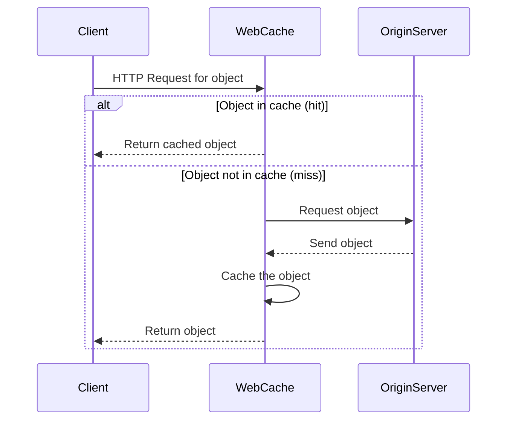
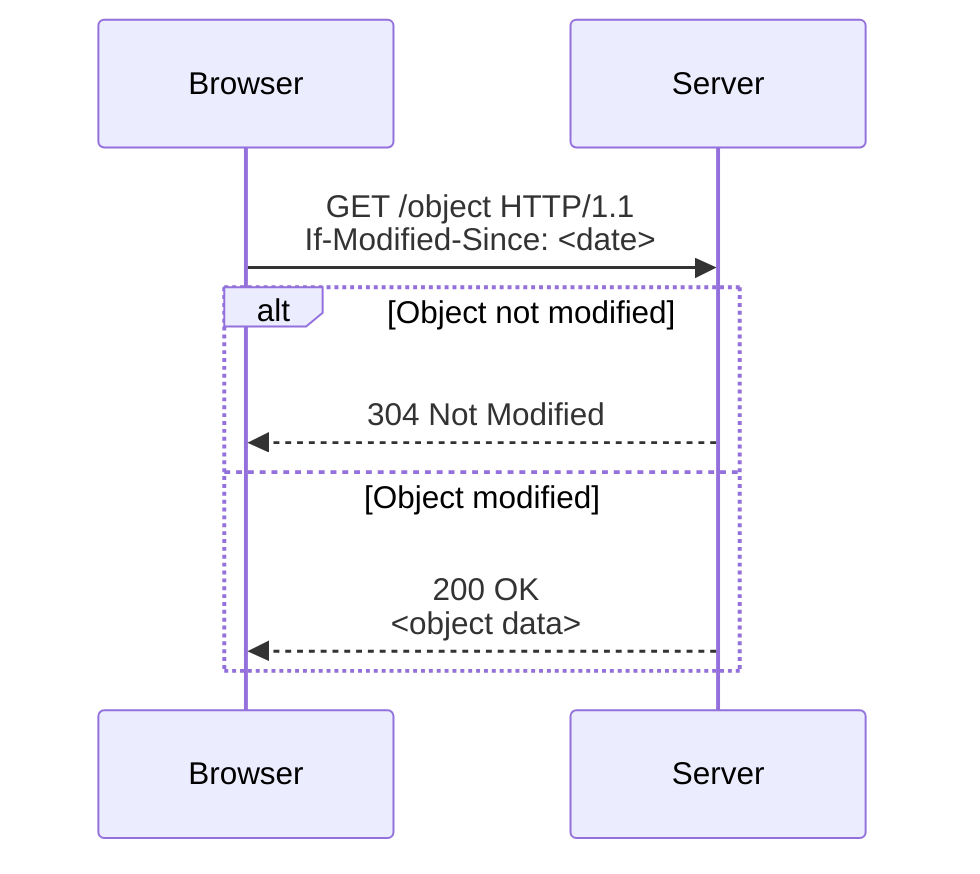
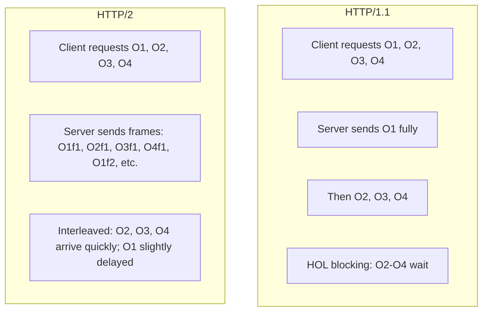

# Lecture 1 Explanation: Pages 40-50 - Web Caches and HTTP/2

This document provides a detailed, easy-to-read explanation of pages 40 to 50 from the PDF "CSE-801/Lecture-1-Internet-Architecture-TCP-IP-Protocol-Suite-IPC-Concept-of-Socket-HTTP-1.1-2-3-Cookies-Web-Caching.pdf". The content focuses on Web Caches (including proxy servers, caching examples, and browser caching with Conditional GET) and HTTP/2 (including HOL blocking mitigation and transition to HTTP/3). All technical terms are explained, and Mermaid diagrams are included for memorization. Explanations are based solely on the provided text.

## 1. Web Caches (Pages 40-44)

### What is a Web Cache?
A **Web cache** (also known as a **proxy server**) is a system that stores copies of web objects (like HTML files, images, or videos) to serve them quickly to clients without repeatedly fetching them from the original source. It acts as an intermediary between the client (e.g., a web browser) and the **origin server** (the original server hosting the content).

- **Client**: The user's browser or device requesting web content.
- **Origin server**: The primary server where the web objects are stored and maintained.
- **Proxy server**: A server that sits between the client and the origin server, forwarding requests and caching responses.

The goal of web caching is to **satisfy client requests without involving the origin server**, reducing load and improving performance.

### How Web Caching Works
1. The user configures their browser to point to a local Web cache (proxy server).
2. The browser sends all HTTP requests to the cache instead of directly to the origin server.
3. If the requested object is in the cache (a **cache hit**), the cache returns it immediately to the client.
4. If the object is not in the cache (a **cache miss**), the cache requests it from the origin server, stores (caches) the received object, and then returns it to the client.

The cache acts as both:
- A **server** for the original requesting client.
- A **client** to the origin server.

### Why Web Caching?
Web caching provides several benefits:
- **Reduce response time**: The cache is closer to the client (e.g., on the same local network), so objects are delivered faster.
- **Reduce traffic on an institution's access link**: By serving cached content locally, it decreases the amount of data flowing over the expensive, slower **access link** (the connection between the local network and the internet).
- **Enable "poor" content providers**: The internet is dense with caches, allowing smaller servers to handle more traffic efficiently.
- **Server control**: The origin server tells the cache about the object's allowable caching via headers in the HTTP response (e.g., whether it can be cached and for how long).

### Caching Example and Performance Analysis
Consider an institutional network (e.g., a university) with:
- A 1 Gbps LAN (Local Area Network, fast internal connection).
- A 1.54 Mbps access link (slower connection to the public internet).
- Origin servers on the public internet.
- Scenario: Web object size = 100K bits (about 12.5 KB), RTT (Round-Trip Time, the time for a small packet to travel from client to server and back) = 2 seconds, average request rate = 15/sec, average data rate to browsers = 1.50 Mbps.

Without caching:
- **Access link utilization** (percentage of link capacity used) = 0.97 (97%, very high, causing congestion).
- **LAN utilization** = 0.0015 (0.15%, very low).
- **End-end delay** (total time from request to response) = Internet delay (2 sec) + access link delay (minutes due to queuing) + LAN delay (microseconds). This results in large queuing delays at high utilization.

**Option 1: Buy a faster access link** (e.g., upgrade to 154 Mbps).
- Cost: Expensive.
- New utilization: Access link = 0.0097 (0.97%), LAN = ?, delay = ? (much lower, but costly).

**Option 2: Install a local web cache**.
- Cost: Cheap.
- The cache reduces requests to the origin server, lowering access link traffic and delays.

To compute utilization and delay with a cache:
- Assume the cache serves some fraction of requests locally.
- Access link utilization decreases, reducing queuing delays.
- LAN utilization increases slightly but remains efficient.

### Mermaid Diagram: Web Cache Interaction

This diagram shows the flow: Client requests → Cache checks → Hit (serve) or Miss (fetch, cache, serve).

## 2. Browser Caching: Conditional GET (Page 45)

### What is Browser Caching?
Unlike a proxy cache, **browser caching** stores objects directly in the client's browser. The goal is to avoid sending objects if the browser already has an up-to-date version, preventing unnecessary transmission delays and network resource use.

### How Conditional GET Works
- **Client (browser)**: Includes the date of its cached copy in the HTTP request using the `If-Modified-Since: <date>` header.
- **Server**: Checks if the object has been modified since that date.
  - If **not modified**, responds with `HTTP/1.0 304 Not Modified` (no object data sent).
  - If **modified**, responds with `HTTP/1.0 200 OK` and the full object data.

This is called a **Conditional GET** because the request is conditional on the object's modification status.

### Benefits
- No object transmission if up-to-date, saving bandwidth and time.
- Reduces server load and network traffic.

### Mermaid Diagram: Conditional GET Flow

This illustrates the conditional check: If unchanged, no data; if changed, full response.

## 3. HTTP/2 (Pages 46-50)

### Overview of HTTP/2
**HTTP/2** (RFC 7540, 2015) improves on HTTP/1.1 by reducing delays in multi-object requests (e.g., a web page with multiple images). Key goal: Decreased delay for loading multiple objects.

HTTP/1.1 introduced pipelining (sending multiple GET requests over one TCP connection), but the server responds in **FCFS (First-Come-First-Served)** order, leading to issues.

### Problems in HTTP/1.1
- **HOL (Head-of-Line) blocking**: A small object waits behind a large one in the response queue, delaying it.
- **Loss recovery**: Retransmitting lost TCP segments stalls all transmissions on that connection.

### HTTP/2 Improvements
HTTP/2 keeps methods, status codes, and most headers from HTTP/1.1 but adds:
- **Client-specified object priority**: Server sends objects based on client priority, not just FCFS.
- **Server push**: Server can send unrequested objects (e.g., predicted resources) to the client.
- **Frames**: Objects are divided into small **frames** (data chunks), allowing interleaved transmission to mitigate HOL blocking.

### Mitigating HOL Blocking in HTTP/2
In HTTP/1.1, if a client requests 1 large object (O1, e.g., video) and 3 small ones (O2, O3, O4), O2-O4 wait for O1 to finish.

In HTTP/2, objects are framed and interleaved: Frames from O1, O2, O3, O4 are sent alternately, so small objects arrive faster, and O1 is only slightly delayed.

### Mermaid Diagram: HOL Blocking Comparison

This shows the difference: HTTP/1.1 serial, HTTP/2 parallel via frames.

### Transition to HTTP/3
HTTP/2 over a single TCP connection still has issues:
- Packet loss stalls all objects (like HTTP/1.1).
- No built-in security (relies on TLS over TCP).
- Browsers open multiple connections to avoid stalling.

**HTTP/3** adds:
- **Security**: Built-in encryption.
- **Per-object error and congestion control**: Better pipelining over UDP (User Datagram Protocol, a faster, connectionless transport layer protocol).
- More details in the transport layer section.

This covers the key points from pages 40-50, with explanations and diagrams for clarity and memorization.