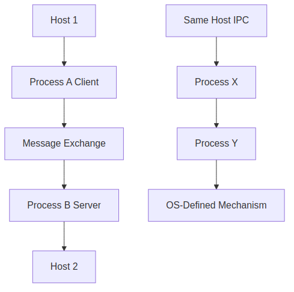
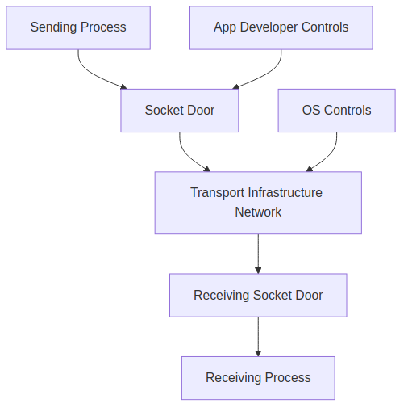
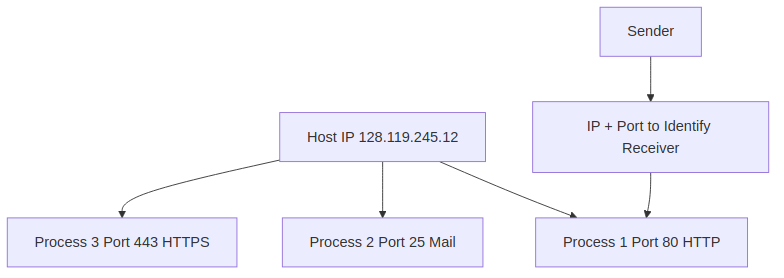
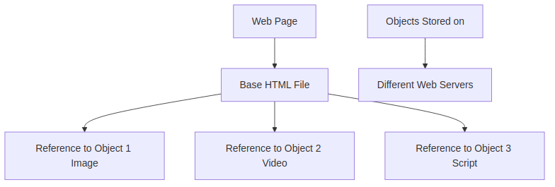

# Detailed Explanation of Lecture 1: Pages 16-20 - Application Layer Protocol - HTTP

This document provides a detailed, easy-to-read explanation of pages 16 to 20 from the PDF "CSE-801/Lecture-1-Internet-Architecture-TCP-IP-Protocol-Suite-IPC-Concept-of-Socket-HTTP-1.1-2-3-Cookies-Web-Caching.pdf". The focus is on the Application Layer Protocol - HTTP, covering processes communicating, sockets, addressing processes, application-layer protocols, and an introduction to Web and HTTP. All technical terms are explained, and Mermaid diagrams are included for better memorization.

## 1. Processes Communicating (Application Layer: 2-16)

### Overview
At the application layer, the main activity is **processes communicating** with each other. A **process** is a program that is running within a host (a computer or device connected to the network). Processes need to exchange information to perform tasks, like browsing a website or sending an email.

### Key Concepts
- **Inter-process communication (IPC)**: When two processes are on the same host, they communicate using mechanisms defined by the operating system (OS). IPC is like internal messaging within the same machine.
- **Message exchange**: Processes on different hosts communicate by exchanging **messages** across the network. These messages are the basic units of data sent between processes.
- **Client-server model**: Many applications use a client-server architecture.
  - **Client process**: A process that initiates communication. For example, your web browser is a client process when you request a webpage.
  - **Server process**: A process that waits to be contacted. For example, a web server waits for requests from clients.

### Diagram: Process Communication

**Explanation of Diagram**:
- Arrows show the flow of communication.
- On the same host, processes use IPC (controlled by the OS).
- On different hosts, messages are exchanged over the network.

**Memorization Tip**: Think of processes as people talking: clients start the conversation, servers listen and respond.

## 2. Sockets (Application Layer: 2-17)

### Overview
A **socket** is the interface between a process and the transport layer. It acts like a door through which messages are sent and received. Sockets enable processes to communicate over the network without worrying about the underlying network details.

### Key Concepts
- **Sending process**: Shoves the message out through the socket, relying on the transport infrastructure (like TCP or UDP) to deliver it to the receiving socket.
- **Receiving process**: Receives the message through its socket.
- **Two sockets involved**: One on the sending side and one on the receiving side.
- **Control**:
  - The socket is controlled by the application developer on the application side.
  - The transport layer (below the socket) is controlled by the OS.

### Diagram: Socket Analogy

**Explanation of Diagram**:
- The socket is the "door" for sending/receiving messages.
- The transport layer handles delivery, like a postal service.

**Memorization Tip**: Socket = Door. You push messages through the door, and the network "mailman" delivers them.

## 3. Addressing Processes (Application Layer: 2-18)

### Overview
To receive messages, a process must have a unique **identifier**. This is crucial because multiple processes can run on the same host.

### Key Concepts
- **Host identifier**: Every host has a unique 32-bit **IP address** (e.g., 128.119.245.12). An IP address is like a street address for a house.
- **Process identifier**: Since multiple processes can run on one host, the IP address alone isn't enough. We need both the IP address and a **port number**.
  - **Port number**: A 16-bit number associated with a specific process on the host. Examples:
    - HTTP server: Port 80 (standard for web servers).
    - Mail server: Port 25 (standard for SMTP email).
- **Complete identifier**: IP address + port number uniquely identifies a process.
- **Example**: To send an HTTP message to the web server at gaia.cs.umass.edu, use IP address 128.119.245.12 and port 80.

### Diagram: Process Addressing

**Explanation of Diagram**:
- Each host has an IP address.
- Processes on the host have unique port numbers.
- Together, they form a unique address.

**Memorization Tip**: IP address = House number. Port number = Apartment number in the house.

## 4. Application-Layer Protocol Definition (Application Layer: 2-19)

### Overview
An **application-layer protocol** defines the rules for how processes communicate. It specifies the format and meaning of messages exchanged between client and server.

### Key Concepts
- **Types of messages**: Common types include **request** (client asks for something) and **response** (server replies).
- **Message syntax**: Defines what fields are in messages and how they are delineated (separated). For example, fields might be separated by commas or specific characters.
- **Message semantics**: The meaning of the information in the fields. For example, what a status code means.
- **Rules**: When and how processes send and respond to messages.
- **Protocol types**:
  - **Open protocols**: Defined in **RFCs** (Request for Comments), publicly available documents. Anyone can access the protocol definition, allowing **interoperability** (different systems can work together). Examples: HTTP, SMTP.
  - **Proprietary protocols**: Owned by a company, not publicly available. Examples: Skype, Zoom. These may not work with other systems.

### Diagram: Protocol Components

**Explanation of Diagram**:
- Protocols have structure: types, syntax, semantics, rules.
- Open vs. proprietary affects accessibility and compatibility.

**Memorization Tip**: Protocol = Recipe. It tells you ingredients (syntax), how to mix (semantics), and steps (rules).

## 5. Web and HTTP (Application Layer: 2-20)

### Overview
This section introduces the **Web** and **HTTP** (HyperText Transfer Protocol), the application-layer protocol for the Web.

### Key Concepts
- **Web page**: Consists of **objects**, each of which can be stored on different web servers. An object can be an HTML file, JPEG image, audio file, etc.
- **Base HTML-file**: The main file of a webpage, which includes references to other objects.
- **URL (Uniform Resource Locator)**: A way to address objects on the Web, e.g., `www.someschool.edu/someDept/pic.gif`.
  - **Host name**: The domain name (e.g., www.someschool.edu).
  - **Pathname**: The path to the specific file (e.g., /someDept/pic.gif).

### Diagram: Web Page Structure

**Explanation of Diagram**:
- A webpage is made of multiple objects linked together.
- The base HTML file points to other objects via URLs.

**Memorization Tip**: Web page = Puzzle. Base HTML is the frame, objects are the pieces from different places.

## Summary
Pages 16-20 lay the foundation for understanding HTTP by explaining how processes communicate, the role of sockets, process addressing, protocol definitions, and the basics of the Web. These concepts are essential for grasping how applications like web browsers and servers interact over the Internet. Use the diagrams to visualize and memorize the relationships between components.