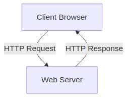
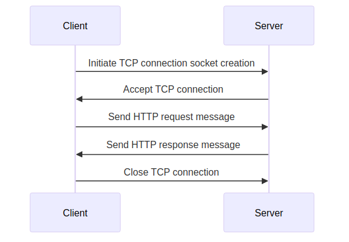
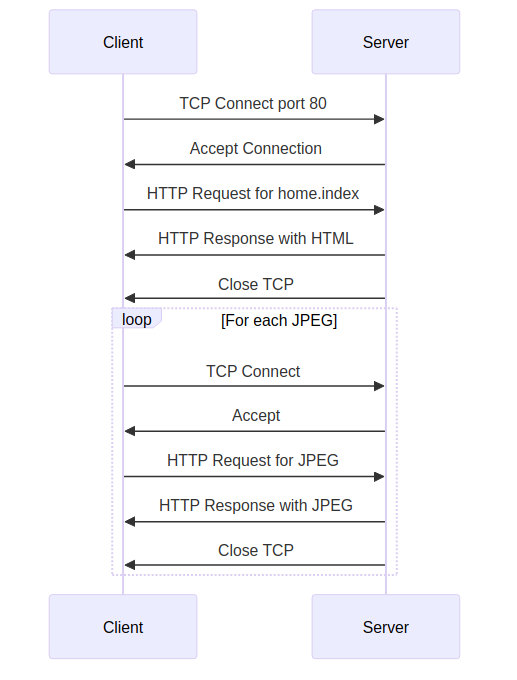

# Detailed Explanation of Pages 21-34: Web and HTTP

This document provides a detailed, easy-to-read explanation of the content from pages 21 to 34 of the lecture notes on Internet Architecture, TCP/IP Protocol Suite, IPC, Concept of Socket, HTTP 1.1, 2, 3, Cookies, Web Caching. All explanations are based solely on the provided text, with no external information added. Technical terms are explained in simple language, and diagrams are included where appropriate using Mermaid syntax for visualization.

## Web and HTTP Overview

### Quick Review of the Web
- **Web Page Structure**: A web page is made up of multiple **objects**. Each object can be stored on different web servers across the internet.
  - Examples of objects: HTML files (the main structure), JPEG images, Java applets (small programs), audio files, etc.
- **Base HTML File**: The main part of a web page is an HTML file that includes references to other objects. Each referenced object has a unique address called a **URL** (Uniform Resource Locator).
  - Example URL: `www.someschool.edu/someDept/pic.gif`
    - **Host name**: `www.someschool.edu` (the server where the object is stored).
    - **Path name**: `/someDept/pic.gif` (the location of the file on that server).

This setup allows web pages to be composed from resources scattered across the internet, making the web flexible and distributed.

### HTTP Overview
- **HTTP Definition**: HTTP stands for **HyperText Transfer Protocol**. It's the application-layer protocol used by the web.
  - **Application-layer protocol**: A set of rules for how applications (like browsers and servers) communicate over the network.
- **Client/Server Model**:
  - **Client**: Typically a web browser (e.g., Safari on iPhone, Firefox on PC) that requests and receives web objects using HTTP, then displays them to the user.
  - **Server**: A web server (e.g., Apache Web server) that sends objects in response to requests using HTTP.
- **Example Setup**:
  - iPhone running Safari browser (client).
  - PC running Firefox browser (client).
  - Server running Apache Web server.



### HTTP and TCP
- **TCP Usage**: HTTP relies on **TCP** (Transmission Control Protocol) for reliable data transfer.
  - **Client Initiates Connection**: The client creates a **socket** (a communication endpoint) and initiates a TCP connection to the server on port 80 (the default port for HTTP).
  - **Server Accepts Connection**: The server accepts the TCP connection from the client.
  - **Message Exchange**: HTTP messages (requests and responses) are exchanged between the browser (HTTP client) and the web server (HTTP server) over this TCP connection.
  - **Connection Closure**: After the exchange, the TCP connection is closed.
- **Stateless Nature**: HTTP is **stateless**, meaning the server does not keep any information about past client requests.
  - **Why Stateless?**: Keeping state (history of interactions) makes protocols complex. If the server or client crashes, their views of the state might not match, requiring reconciliation (fixing inconsistencies).
  - **Aside**: Protocols that maintain state are more complex to manage.



## HTTP Connections: Two Types

### Non-Persistent HTTP
- **Definition**: Each object is sent over a separate TCP connection.
  - **Steps**:
    1. Open a TCP connection.
    2. Send at most one object over the connection.
    3. Close the TCP connection.
  - **Drawback**: Downloading multiple objects requires multiple connections, which is inefficient.

### Persistent HTTP
- **Definition**: Multiple objects can be sent over a single TCP connection between the client and server.
  - **Steps**:
    - Open one TCP connection to the server.
    - Send multiple objects over this connection.
    - Close the connection when done.
- **Advantage**: More efficient for transferring multiple objects.


## Non-Persistent HTTP: Example
- **Scenario**: User enters URL: `www.someSchool.edu/someDepartment/home.index` (an HTML file containing text and references to 10 JPEG images).
- **Steps**:
  1. **Client Initiates TCP**: HTTP client starts a TCP connection to the HTTP server at `www.someSchool.edu` on port 80.
  2. **Server Accepts**: The server at `www.someSchool.edu` waits for connections on port 80 and accepts the connection, notifying the client.
  3. **Client Sends Request**: Client sends an HTTP request message containing the URL, indicating it wants the object `someDepartment/home.index`.
  4. **Server Responds**: Server receives the request, creates a response message with the requested object (HTML file), and sends it back via its socket.
  5. **Client Receives and Parses**: Client gets the HTML file, displays it. While parsing, it finds 10 referenced JPEG objects.
  6. **Repeat for Each Object**: Steps 1-5 are repeated for each of the 10 JPEG objects.
- **Connection Closure**: After sending the response, the server closes the TCP connection.



### Response Time in Non-Persistent HTTP
- **RTT Definition**: **Round-Trip Time (RTT)** is the time for a small packet to travel from client to server and back.
- **HTTP Response Time per Object**:
  - One RTT to initiate the TCP connection.
  - One RTT for the HTTP request and the first few bytes of the HTTP response.
  - Time to transmit the file/object.
- **Total Formula**: Non-persistent HTTP response time = 2RTT + file transmission time.


## Persistent HTTP (HTTP 1.1)
- **Issues with Non-Persistent HTTP**:
  - Requires 2 RTTs per object (inefficient).
  - OS overhead (system resources) for each TCP connection.
  - Browsers often open multiple parallel TCP connections to fetch objects faster.
- **Persistent HTTP (HTTP 1.1)**:
  - Server keeps the connection open after sending a response.
  - Subsequent HTTP messages between the same client/server use the open connection.
  - Client sends requests as soon as it finds referenced objects.
  - Can reduce to as little as one RTT for all referenced objects (cutting response time in half).


## HTTP Request Message
- **Message Types**: HTTP has two main types: request and response.
- **HTTP Request Message**:
  - **Format**: ASCII (human-readable text).
  - **Components**:
    - **Header Lines**: Provide metadata (e.g., browser type, accepted formats).
    - **Example Request**:
      ```
      GET /index.html HTTP/1.1\r\n
      Host: www-net.cs.umass.edu\r\n
      User-Agent: Mozilla/5.0 (Macintosh; Intel Mac OS X 10.15; rv:80.0) Gecko/20100101 Firefox/80.0\r\n
      Accept: text/html,application/xhtml+xml\r\n
      Accept-Language: en-us,en;q=0.5\r\n
      Accept-Encoding: gzip,deflate\r\n
      Connection: keep-alive\r\n
      \r\n
      ```
      - **Carriage Return (\r)** and **Line Feed (\lf)**: Special characters to end lines.
      - **Request Line**: `GET /index.html HTTP/1.1` – Method (GET), URL, Version.
      - **Header Fields**: `Host`, `User-Agent`, etc.
      - Empty line indicates end of headers.
- **General Format**:
  ```
  Request Line: method sp URL sp version cr lf
  Header Lines: header-field-name: value cr lf
  (repeated)
  cr lf (empty line)
  Entity Body (optional)
  ```


### Other HTTP Request Methods
- **POST Method**: Used when a web page has form input. User data is sent in the **entity body** of the HTTP POST request message.
- **GET Method (with Data)**: User data can be included in the URL after a '?'. Example: `www.somesite.com/animalsearch?monkeys&banana`.
- **HEAD Method**: Requests only the headers that would be returned if the URL were requested with GET. Useful for checking without downloading the full object.
- **PUT Method**: Uploads a new file (object) to the server, replacing any existing file at that URL with the content in the entity body.

## HTTP Response Message
- **Components**:
  - **Status Line**: Includes protocol version, status code, and status phrase.
  - **Header Lines**: Metadata like date, server info, content type.
  - **Data**: The requested object (e.g., HTML file).
- **Example Response**:
  ```
  HTTP/1.1 200 OK
  Date: Tue, 08 Sep 2020 00:53:20 GMT
  Server: Apache/2.4.6 (CentOS) OpenSSL/1.0.2k-fips PHP/7.4.9 mod_perl/2.0.11 Perl/v5.16.3
  Last-Modified: Tue, 01 Mar 2016 18:57:50 GMT
  ETag: "a5b-52d015789ee9e"
  Accept-Ranges: bytes
  Content-Length: 2651
  Content-Type: text/html; charset=UTF-8
  \r\n
  data data data data data ...
  ```


### HTTP Response Status Codes
- **Status Codes**: Appear in the first line of the server-to-client response. Indicate the result of the request.
- **Examples**:
  - **200 OK**: Request succeeded; the requested object is in the message.
  - **301 Moved Permanently**: Object moved; new location in the "Location" field.
  - **400 Bad Request**: Server couldn't understand the request message.
  - **404 Not Found**: Document not found on the server.
  - **505 HTTP Version Not Supported**: Server doesn't support the HTTP version used.

This covers the key concepts from pages 21-34, focusing on HTTP's structure, connections, messages, and status codes, with diagrams for clarity.