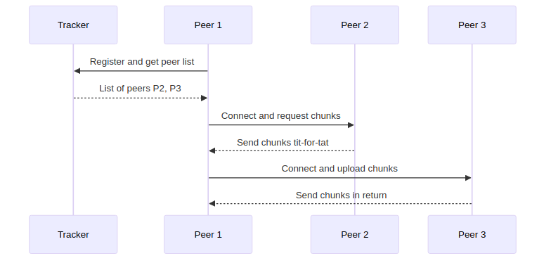

# Detailed Explanation of Pages 33-41: BitTorrent

This document provides a detailed, easy-to-read explanation of the BitTorrent section from pages 33 to 41 of the PDF "CSE-801/Lecture-2-SMTP-POP3-IMAP-DNS-FTP-BitTorrent-Multimedia-Streaming-DASH-CDN.pdf". All technical terms are explained clearly, and Mermaid diagrams are included for better memorization. Figures from the original content are described and recreated where possible.

## BitTorrent: Peer-to-Peer File Distribution

BitTorrent is a protocol for distributing files in a peer-to-peer (P2P) network, where participants (called peers) share parts of the file directly with each other, reducing the load on a central server.

### Key Concepts in File Distribution

- **Client-Server Model**: In this traditional approach, a single server sends the entire file to each requesting client. This can lead to high server load and slow distribution as the number of clients increases.
- **Peer-to-Peer (P2P) Model**: Peers download and upload file parts simultaneously. Each peer acts as both a client (downloading) and a server (uploading), improving efficiency and scalability.

#### Time Calculations for File Distribution

Consider distributing a file of size \( F \) from one server to \( N \) peers, where:
- \( u_s \): Server upload capacity (bits per second).
- \( u_i \): Upload capacity of peer \( i \).
- \( d_i \): Download capacity of peer \( i \).
- \( d_{min} \): Minimum download rate among peers.

For **Client-Server**:
- Server must send \( N \) copies: Time = \( \frac{NF}{u_s} \).
- Each client downloads: Time = \( \frac{F}{d_{min}} \).
- Total time: \( D_{c-s} \geq \max\left( \frac{NF}{u_s}, \frac{F}{d_{min}} \right) \).

For **P2P**:
- Server sends at least one copy: Time = \( \frac{F}{u_s} \).
- Aggregate download: \( NF \) bits, max upload rate = \( u_s + \sum u_i \).
- Total time: \( D_{P2P} \geq \max\left( \frac{F}{u_s}, \frac{F}{d_{min}}, \frac{NF}{u_s + \sum u_i} \right) \).

P2P scales better as each peer adds capacity.

#### BitTorrent Mechanics

- **Torrent**: A group of peers exchanging chunks of a file.
- **Tracker**: A central server that maintains a list of peers in the torrent.
- **Chunks**: The file is divided into small pieces (e.g., 256 KB) for efficient sharing.
- **Peer Joining**: A new peer registers with the tracker, gets a list of peers, and connects to a subset (neighbors). It downloads chunks while uploading to others.
- **Churn**: Peers may join or leave the network dynamically.

##### Requesting and Sending Chunks

- Peers periodically ask neighbors for their chunk lists.
- Missing chunks are requested, prioritizing rare ones first (to ensure availability).
- **Tit-for-Tat**: A strategy to encourage fair sharing. A peer sends chunks to the top 4 peers providing the highest upload rates. Every 10 seconds, the top 4 are re-evaluated. Every 30 seconds, a random peer is "optimistically unchoked" to discover better partners.

This reciprocal mechanism ensures peers contribute to the network.

### Mermaid Diagram: Client-Server vs P2P File Distribution

- **Description**: In client-server, the server (A) sends the file to each client (B-E). In P2P, peers (F-I) share chunks among themselves, reducing server load.

### Mermaid Diagram: BitTorrent Process

- **Description**: Peer 1 joins via the tracker, connects to peers, and exchanges chunks using tit-for-tat.

## Summary

- **BitTorrent**: Efficient peer-to-peer (P2P) file sharing using chunks and tit-for-tat strategies, outperforming client-server models for large-scale distribution by leveraging user devices as both downloaders and uploaders.

All terms (e.g., peer, chunk, torrent, tracker, tit-for-tat) are defined inline for clarity. Mermaid diagrams visualize processes for easy memorization.