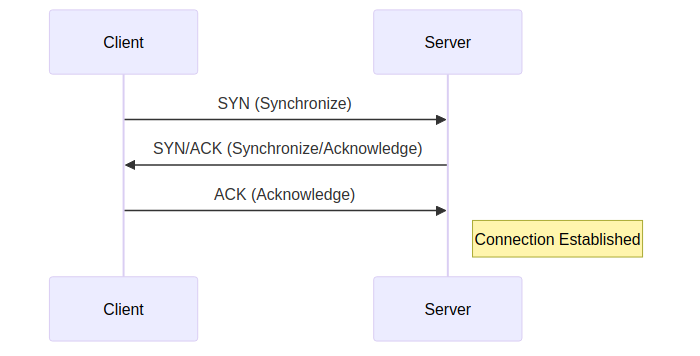

# A Comprehensive Guide to the 7 Layers of the OSI Model

The Open Systems Interconnection (OSI) model is a conceptual framework that standardizes the functions of a telecommunication or computing system in seven abstract layers. This guide provides a detailed walkthrough of each layer, starting from the top (Layer 7) and moving down to the bottom (Layer 1).

---

## Layer 7: The Application Layer

- **Primary Function:** The Application Layer is the top layer of the OSI model and is the one closest to the end-user. Its primary function is to provide network services directly to user applications. It acts as the interface between the applications on a computer and the network itself. When you use a web browser, email client, or file transfer program, you are interacting with the Application Layer.
- **PDU:** Data

### Key Protocols

-   **HTTP (Hypertext Transfer Protocol):**
    *   **Function:** HTTP is the foundation of data communication for the World Wide Web. It is an application-layer protocol for transmitting hypermedia documents, such as HTML.
    *   **Characteristics:** It is a stateless, connectionless protocol. Each command is executed independently, without any knowledge of the commands that came before it. It operates on **TCP port 80** (for HTTP) and **port 443** (for HTTPS, the secure version).
    *   **Real-World Example:** When you type a URL into your web browser, the browser (the client) sends an HTTP `GET` request to the webserver hosting the site. The server processes the request and sends back an HTTP response containing the webpage's content (HTML, CSS, images), which your browser then renders.

-   **SMTP (Simple Mail Transfer Protocol):**
    *   **Function:** SMTP is the standard protocol for sending email. When you send an email, your email client interacts with an SMTP server to push the email from your outbox across the internet to the recipient's mail server.
    *   **Characteristics:** SMTP is a connection-oriented, text-based protocol that operates on **TCP port 25**. It is a "push" protocol, meaning it only sends emails.
    *   **Real-World Example:** You compose an email in Outlook and hit "Send." Outlook connects to your email provider's SMTP server (e.g., `smtp.gmail.com`). It authenticates you and then transfers the email content, which the SMTP server then routes to the recipient's mail server.

-   **DNS (Domain Name System):**
    *   **Function:** DNS is the "phonebook of the internet." It translates human-readable domain names (like `www.google.com`) into machine-readable IP addresses (like `172.217.16.196`).
    *   **Characteristics:** DNS typically uses **UDP port 53** for queries because speed is critical. For zone transfers (transferring a large amount of data between DNS servers), it uses **TCP port 53**.
    *   **Real-World Example:** Before your browser can send an HTTP request to `www.google.com`, it must know the server's IP address. It sends a DNS query to a DNS resolver, which finds the corresponding IP address and returns it to the browser.

---

## Layer 6: The Presentation Layer

- **Primary Function:** The Presentation Layer is responsible for the translation, encryption, and compression of data. It ensures that data sent from the application layer of one system can be read by the application layer of another system. It acts as a "data translator" for the network.
- **PDU:** Data

### Key Functions (Protocols are less distinct here)

-   **Data Formatting/Translation:**
    *   **Function:** Different computers may use different data encoding schemes (e.g., ASCII, EBCDIC). The Presentation Layer translates data into a standard format that the receiving computer can understand.
    *   **Real-World Example:** A computer running Windows with ASCII character encoding sends data to a mainframe computer that uses EBCDIC. The Presentation Layer handles the conversion so that the text is readable on both ends.

-   **Encryption and Decryption:**
    *   **Function:** For security, the Presentation Layer is responsible for encrypting data before it is sent over the network and decrypting it upon arrival.
    *   **Real-World Example:** When you connect to your bank's website via HTTPS, protocols like **SSL (Secure Sockets Layer)** or **TLS (Transport Layer Security)** operate at this layer. They encrypt your login credentials and financial data, making it unreadable to anyone who might intercept it.

-   **Data Compression:**
    *   **Function:** This layer can compress data to reduce the number of bits that need to be transmitted, improving the speed and efficiency of communication.
    *   **Real-World Example:** When streaming a video, compression formats like **MPEG (Moving Picture Experts Group)** are used to reduce the size of the video file, allowing it to be transmitted more quickly and with less bandwidth.

---

## Layer 5: The Session Layer

- **Primary Function:** The Session Layer is responsible for establishing, managing, and terminating sessions (connections) between applications. It handles session setup, data synchronization, and checkpointing.
- **PDU:** Data

### Key Functions and Protocols

-   **Session Management:**
    *   **Function:** This layer sets up, maintains, and tears down the communication channel (the session) between two devices. It determines whether the communication will be half-duplex (one device sends at a time) or full-duplex (both devices can send simultaneously).
    *   **Real-World Example:** When you log into a web application, the Session Layer establishes a session that keeps you logged in as you navigate between different pages. When you log out or the session times out, this layer terminates the connection.

-   **Authentication and Authorization:**
    *   **Function:** It plays a role in verifying the identity of the parties in the session.
    *   **Real-World Example:** Protocols like **NetBIOS (Network Basic Input/Output System)** use session layer services to establish connections between computers on a LAN for file and printer sharing.

-   **Checkpointing and Recovery:**
    *   **Function:** If a large file transfer is interrupted, the Session Layer can insert checkpoints into the data stream. If the connection is lost, the transfer can be resumed from the last checkpoint rather than starting over from the beginning.
    *   **Real-World Example:** During a large 2 GB file download, if the network connection drops at 1.5 GB, the Session Layer allows the download to resume from that point once the connection is restored, saving time and bandwidth.

---

## Layer 4: The Transport Layer

- **Primary Function:** The Transport Layer provides reliable or unreliable delivery of data segments between hosts. It is responsible for end-to-end communication, flow control, and error correction.
- **PDU:** Segment (for TCP), Datagram (for UDP)

### Key Protocols

-   **TCP (Transmission Control Protocol):**
    *   **Function:** TCP is a reliable, connection-oriented protocol that guarantees the delivery of data segments in the correct order.
    *   **Characteristics:** It establishes a connection using a **three-way handshake**, performs error checking, and retransmits lost segments. It is used for applications where reliability is more important than speed, such as web browsing, email, and file transfers.
    *   **Real-World Example:** When you download a file, TCP ensures that every single piece of the file arrives and is reassembled in the correct order. If a segment is lost, TCP requests the sender to re-send it.
    *   **TCP Three-Way Handshake Diagram:**
        

-   **UDP (User Datagram Protocol):**
    *   **Function:** UDP is a simple, connectionless protocol that offers very fast, low-overhead data delivery.
    *   **Characteristics:** It is unreliable, meaning it does not guarantee delivery or order. There is no handshake, no error correction, and no retransmission. It is used for applications where speed is more important than reliability, such as live video streaming, online gaming, and DNS queries.
    *   **Real-World Example:** During a live video call (e.g., on Zoom or Skype), using UDP is preferable. If a few packets are lost, it results in a momentary glitch in the video, which is better than pausing the entire stream to wait for a retransmission (as TCP would do).

---

## Layer 3: The Network Layer

- **Primary Function:** The Network Layer is responsible for logical addressing (IP addressing) and routing. It determines the best path to move data packets from the source to the destination across one or more networks.
- **PDU:** Packet

### Key Protocols

-   **IP (Internet Protocol):**
    *   **Function:** IP is the primary protocol of the Network Layer. It is responsible for assigning a unique logical address (IP address) to each device on a network and for routing packets of data between them.
    *   **Characteristics:** IP is a connectionless protocol, meaning it does not guarantee delivery. It relies on TCP at the Transport Layer to provide reliability. It comes in two versions: **IPv4** (e.g., `192.168.1.1`) and **IPv6** (e.g., `2001:0db8:85a3:0000:0000:8a2e:0370:7334`).
    *   **Real-World Example:** When you send an email, the data is broken into IP packets. Each packet has a header containing the source IP address (your computer) and the destination IP address (the mail server). Routers on the internet read this destination IP address to forward the packet along the best path toward its destination.
    *   **Simplified IP Packet Header Diagram:**
        

-   **ICMP (Internet Control Message Protocol):**
    *   **Function:** ICMP is used by network devices to send error messages and operational information. It is not used to carry end-user data.
    *   **Characteristics:** It provides feedback about problems in the network, such as an unreachable host or a packet that has exceeded its Time-To-Live (TTL).
    *   **Real-World Example:** The popular `ping` command uses ICMP. When you `ping google.com`, your computer sends an ICMP "Echo Request" packet to the Google server. If the server is reachable, it replies with an ICMP "Echo Reply" packet, confirming connectivity.

---

## Layer 2: The Data Link Layer

- **Primary Function:** The Data Link Layer is responsible for node-to-node data transfer (between two directly connected nodes) and for detecting and correcting errors that may occur in the Physical Layer. It is divided into two sublayers: the Logical Link Control (LLC) and the Media Access Control (MAC).
- **PDU:** Frame

### Key Protocols and Concepts

-   **Ethernet:**
    *   **Function:** Ethernet is the most common Data Link Layer technology used in wired local area networks (LANs). It defines how data is formatted into frames and transmitted over a physical medium.
    *   **Characteristics:** Each Ethernet frame contains a **MAC (Media Access Control) address** for both the source and destination devices. A MAC address is a unique 48-bit hardware identifier burned into the network interface card (NIC) of a device.
    *   **Real-World Example:** Your laptop is connected to a switch via an Ethernet cable. When you send data, your computer's NIC creates an Ethernet frame. This frame contains the MAC address of the destination device (e.g., your router) and is sent over the cable. The switch reads the destination MAC address and forwards the frame only to the port connected to that device.

-   **ARP (Address Resolution Protocol):**
    *   **Function:** ARP is used to resolve a known IP address (Layer 3) to a MAC address (Layer 2).
    *   **Characteristics:** When a device needs to send a packet to another device on the same local network, it knows the destination IP address but not the MAC address. It sends an ARP request broadcast to the entire network, asking, "Who has this IP address?" The device with that IP address replies with its MAC address.
    *   **Real-World Example:** Your computer (IP `192.168.1.10`) wants to send data to your printer (IP `192.168.1.20`). It sends an ARP broadcast asking, "Who is `192.168.1.20`?" The printer responds, "I am, and my MAC address is `00-1A-2B-3C-4D-5E`." Your computer then sends the Ethernet frame directly to that MAC address.

---

## Layer 1: The Physical Layer

- **Primary Function:** The Physical Layer is the lowest layer of the OSI model. It is responsible for the transmission and reception of unstructured raw data between a device and a physical transmission medium. It deals with the physical characteristics of the network, such as the type of cable, the voltage levels, and the pinout of connectors.
- **PDU:** Bits

### Key Components and Concepts

-   **Cabling and Connectors:**
    *   **Function:** This includes the physical medium used to transmit signals, such as **Ethernet cables (e.g., Cat 6)**, **fiber optic cables**, and **coaxial cables**. It also defines the physical connectors (e.g., **RJ45** for Ethernet).
    *   **Real-World Example:** The Ethernet cable connecting your computer to the wall jack is a component of the Physical Layer.

-   **Signaling Method:**
    *   **Function:** It defines how the 1s and 0s of the digital data are converted into electrical signals (for copper wires), light pulses (for fiber optics), or radio waves (for Wi-Fi).
    *   **Real-World Example:** For an Ethernet connection, a "1" might be represented by a positive voltage and a "0" by a negative voltage.

-   **Hubs and Repeaters:**
    *   **Function:** These are simple network devices that operate at the Physical Layer. A **repeater** regenerates a signal to extend the distance it can travel. A **hub** is a multi-port repeater; it receives a signal on one port and blindly broadcasts it out to all other ports.
    *   **Real-World Example:** In an old network setup, a hub would connect multiple computers. If one computer sent data, the hub would forward that data to every other computer, regardless of the intended recipient. Hubs are now largely replaced by more intelligent switches that operate at Layer 2.

---

## Summary: The Encapsulation and De-encapsulation Process

Data transmission down the OSI stack is called **encapsulation**, where each layer adds its own header (and sometimes a trailer) to the data it receives from the layer above. The reverse process, called **de-encapsulation**, occurs on the receiving end.

### Encapsulation (Sending Data)

### De-encapsulation (Receiving Data)

The receiver performs the process in reverse, stripping off headers at each layer until the original user data is delivered to the receiving application.
1.  **Physical Layer:** Receives bits and assembles them into a frame.
2.  **Data Link Layer:** Removes the Ethernet header and trailer, checks the MAC address, and passes the packet up.
3.  **Network Layer:** Removes the IP header, checks the IP address, and passes the segment up.
4.  **Transport Layer:** Removes the TCP header, reassembles the data, and passes it up.
5.  **Session Layer:** Manages the session and passes the data up.
6.  **Presentation Layer:** Translates, decrypts, and decompresses the data.
7.  **Application Layer:** Presents the final data ("hello") to the user's application.